# Fusion Apps Setup in IDCS

This guide describes the end-to-end process of configuring FA provisioning Application in IDCS. This App has been tested against Fusion Apps R12 demo environment from GSE. It has not yet been tested against production Oracle SAAS cloud.

# **Step-by-step guide**

1.  Download IDCS Metadata to a local XML file

    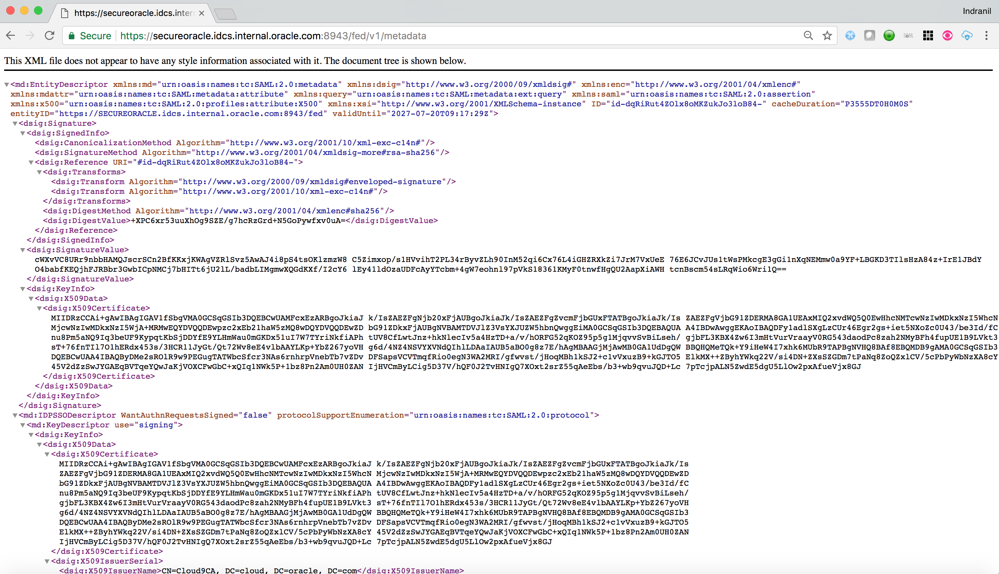
    
    
	>**Note:** **Step 2-10** need to be executed to enable federated SSO 
	with Fusion Apps. If executed against a customer environment, 
	these steps need to be carried out by **Oracle Support**.

2.  Login to internal OAM Console (part of SIM) of the FA environment with OAM admin credential

3.  Go to the <u>Federation</u> tab inside OAM Console. Click on <u>Service Provider Management</u> link

	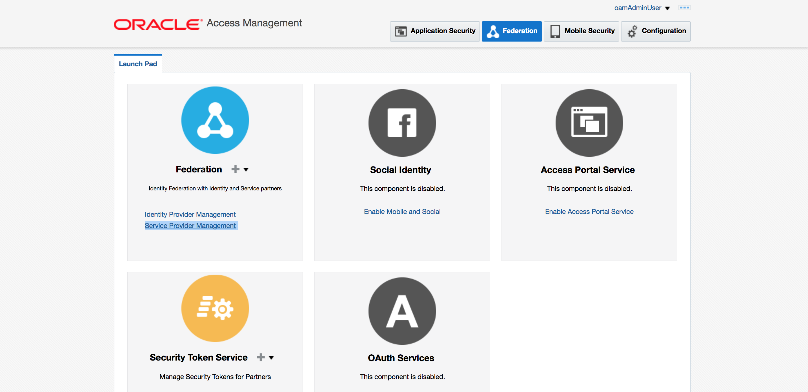
	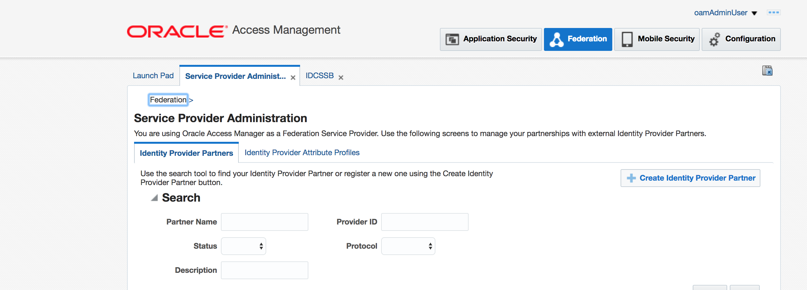

4.  Click on <u>Create Identity Provider Partner</u> button

5.  Select <u>Load from provider metadata</u> and choose the locally saved IDCS metadata file.

6.  Provide a name of the IdP partner

	

7.  Ensure User Mapping attribute is set to <u>mail</u>

	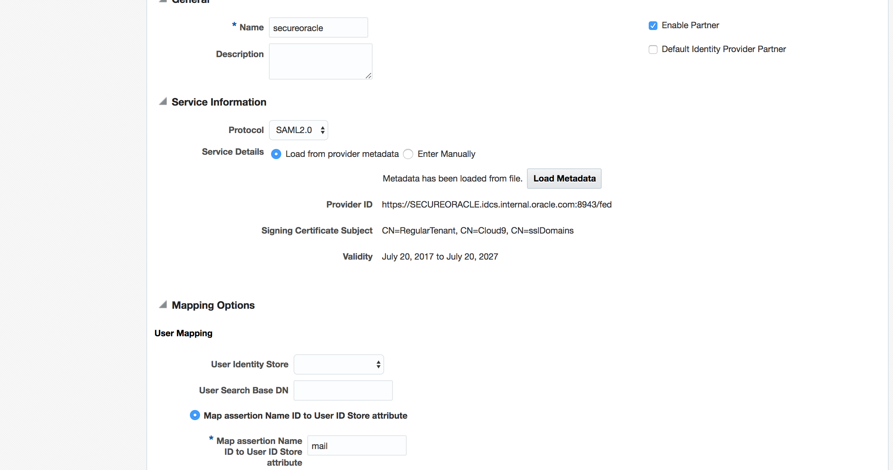

8. 	 Save the configuration

9.   Obtain the <u>Entity ID</u> from the Federation SP metadata for SIM from **Oracle Support**. Typically it is of the form - [https://{Tenant}-idm.{Domain}/fed
]()

10.  Obtain the SP metadata <u>Signing Certificate</u> for SIM from **Oracle Support**. 

	> If you have access to SIM, you can build the certificate from the metadata. The metadata is avialble from - h[ttps://{Tenant}-idm.{Domain}/fed/sp/metadata](). Once you have the metadata, you can create the certificate file manually using the value of **&lt;X509Certificate&gt;** tag inside the metadata.

9.  Go to <u>IDCS Admin console</u> -&gt; <u>Applications</u> tab

10. Click on **Add** button and select **App Catalog**

    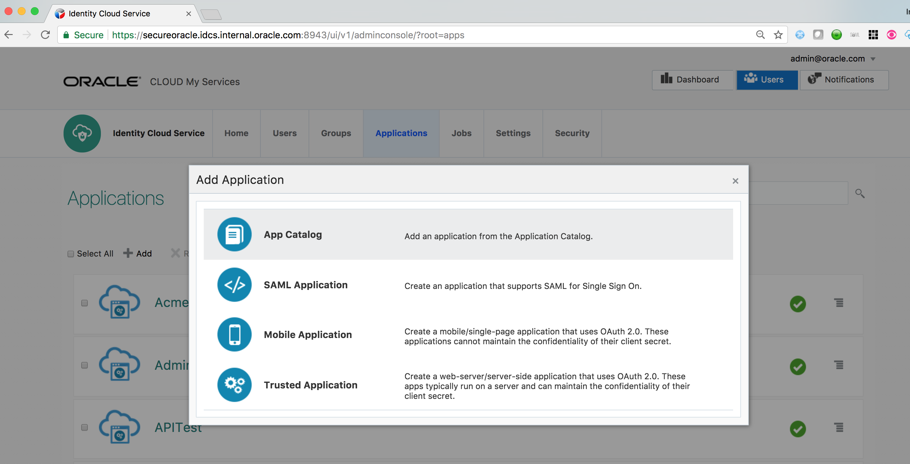
     

11. Search for Oracle Fusion Applications Prov App and **Add**

	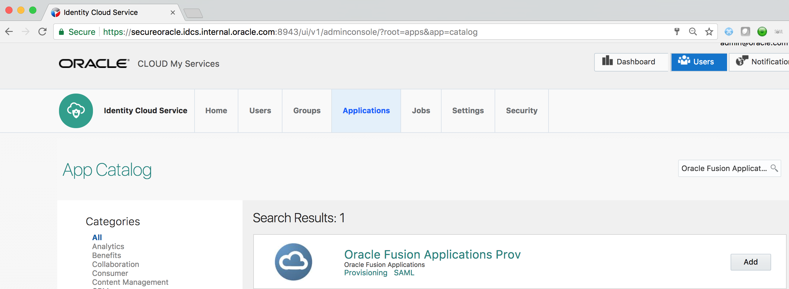

12. On the first page of Configuration screen provide the Tenant Name and Domain Name values for your Fusion App environment. 

	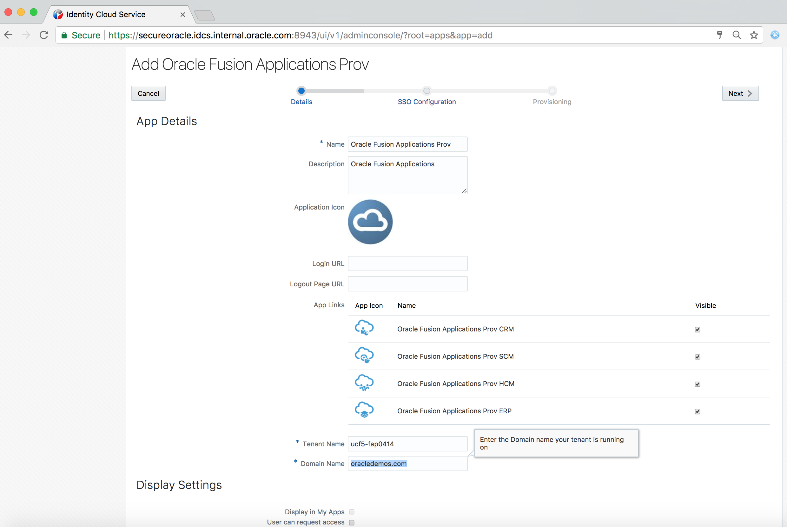

13. Click on **Next**

14. Provide the noted Entity ID value. Upload the Signing Certificate previously saved.

	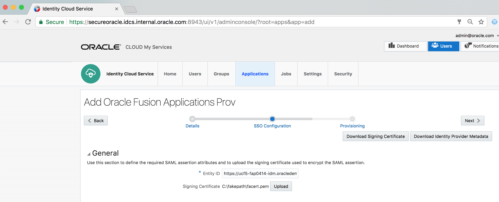

14. Click on **Next**
   
15. Switch on the **Enable Provisioning** slider

	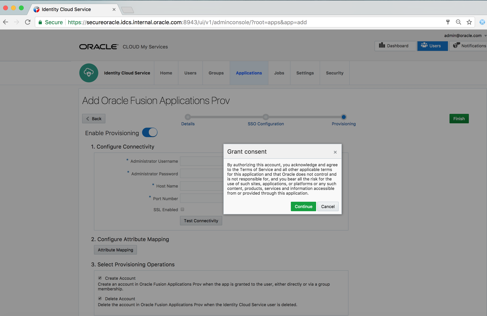
   
16. Provide *Administrator Username*, *Password*, FA Env *Hostname* for REST API (Format - [&lt;tenant&gt;-hcm.&lt;domain&gt;]()) and *port number* (443). Also select *SSL Enabled* checkbox.

18. Test the connectivity

	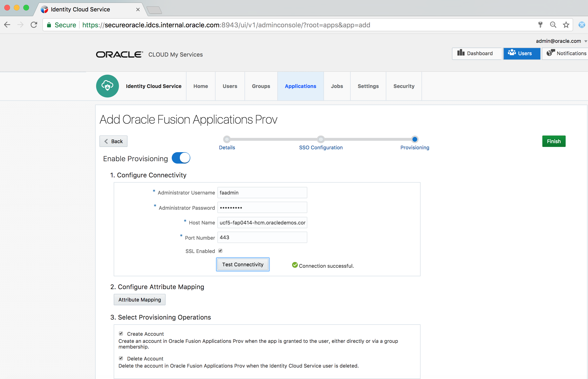

25. Switch on the **Enable Synchronization** slider

	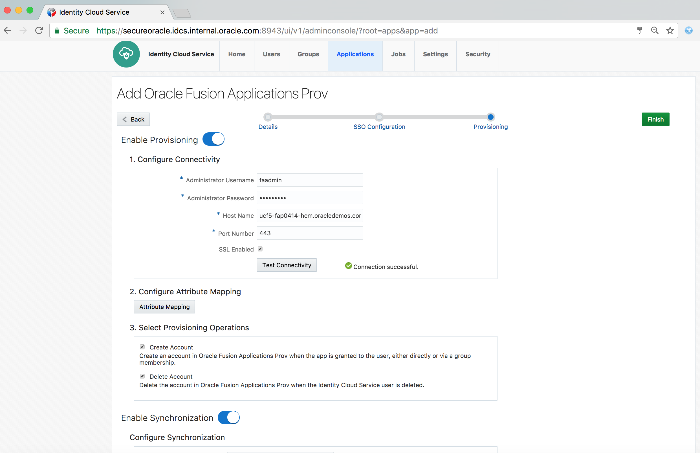

26. Click on **Finish** button

27. **Activate** the application

	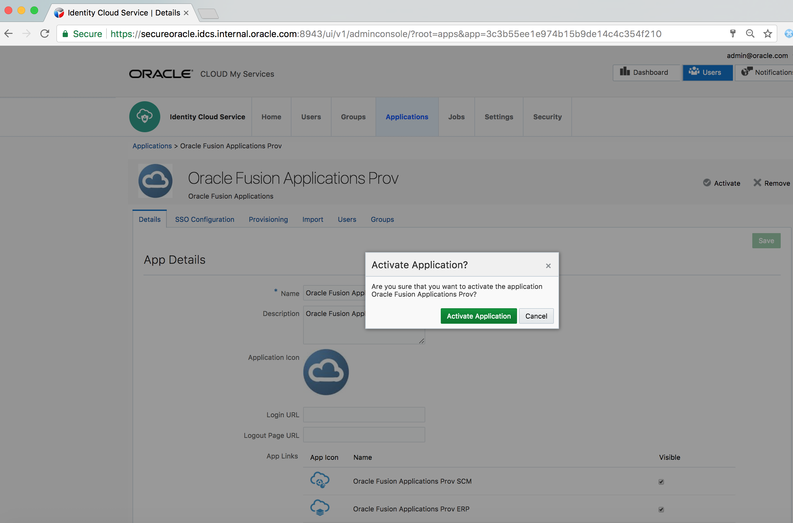
	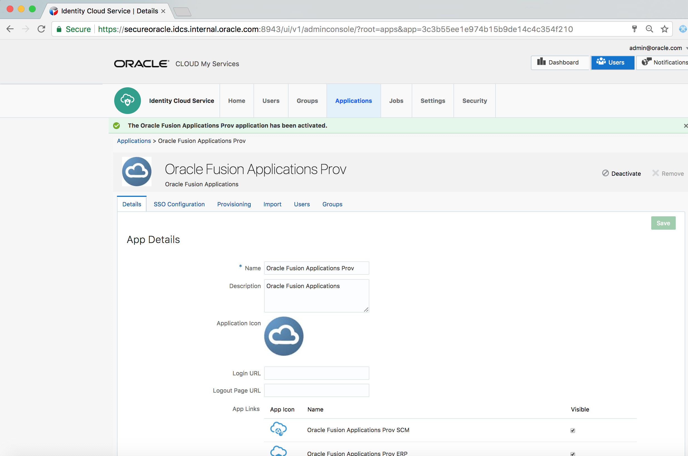

28. Go to the **Import** tab of the application

29. Click on the **Import** link. It will start the **Import job**.

	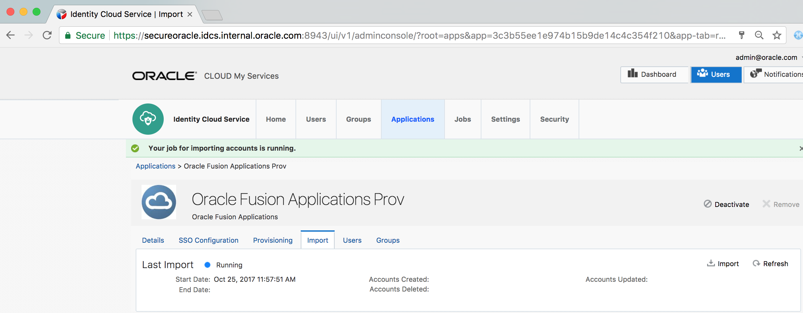

30. Refresh the page after a while

31. Verify that the job is completed and existing FA users have been imported and displayed on the page

	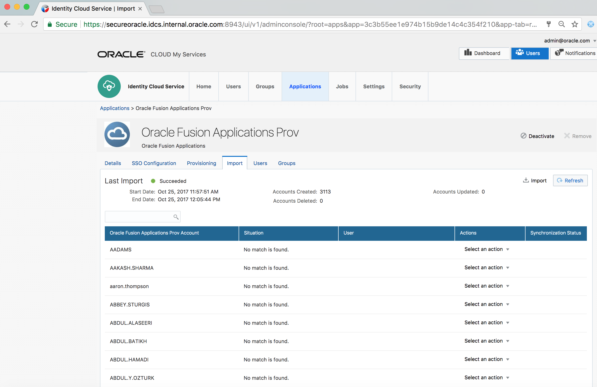

32. Go to the **Users** tab of the application and click on **Assign**

33. Select a user

	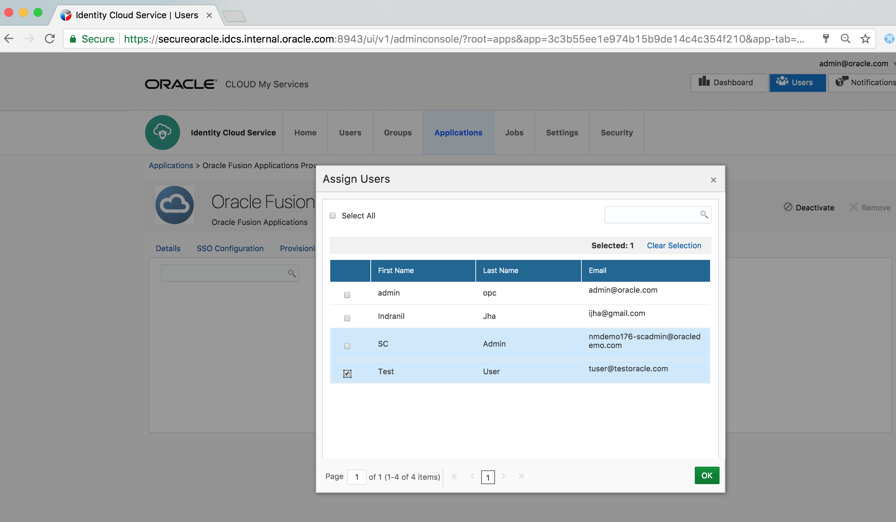

34. Verify that user is successfully assigned to the App

	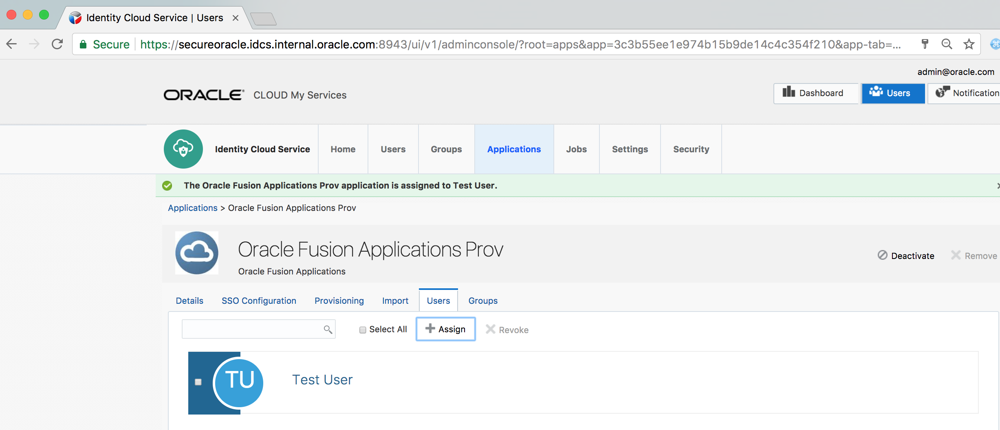

36. Go to an Incognito browser window and login to IDCS **MyConsole** using the assigned user’s credentials

	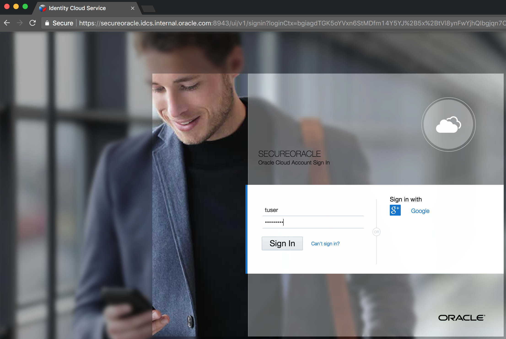

37. Verify that the **Fusion Applications** are displayed there

	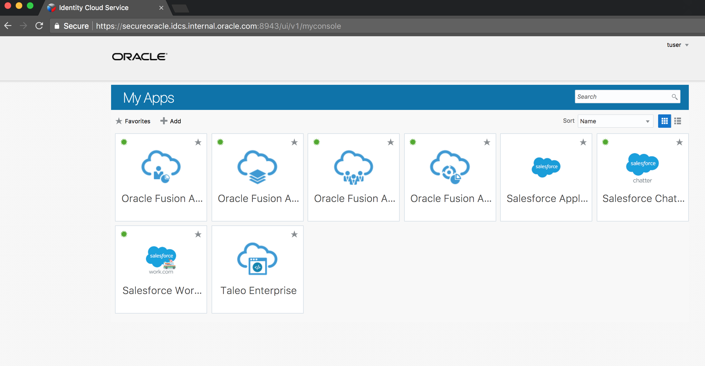

38. Click on the Oracle Fusion Applications Prov HCM app

39. Verify **SSO**

 