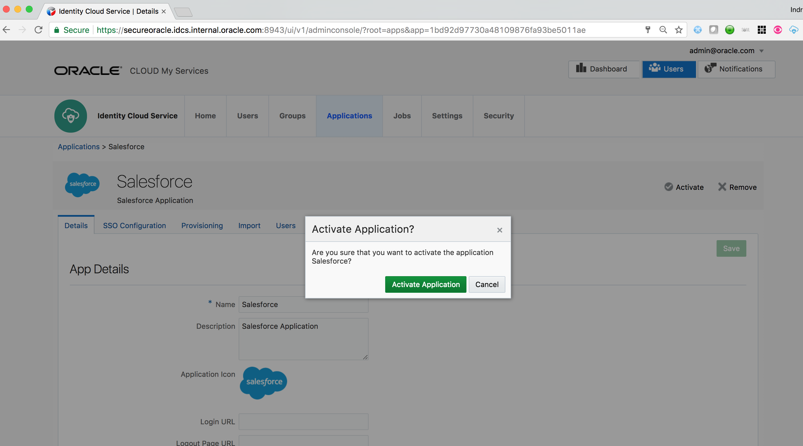

# Salesforce Provisioning App (Alpha version) Setup

This guide describes the end-to-end process of configuring Salesforce provisioning Application in IDCS. This App is available only on the 17.4.2 VM Image and corresponding GSE demo environment for 17.4.2. It is not available in production/trial environment.

# **Step-by-step guide**

1.  Download IDCS Metadata to a local XML file

    

2.  Login to [salesforce.com](http://salesforce.com) tenant with Administrator credentials

3.  Go to Single Sign-On settings under  Security Controls menu

4.  Enable Federated Single Sign-On

    

5.  Import IDCS Metadata - Use New from Metadata File option

6.  Save the configuration
    

    

    

    

    

    

     

7.  Note the Organization ID value

    

     

8.  Note the Tenant Domain Name value

    

9.  Go to IDCS Admin console -&gt; Applications tab

10. Click on Add button and select App Catalog

    

     

11. Search for Salesforce App and Add

    

12. On the first page of Configuration screen provide the previously noted Organization ID and Domain Name values

13. Click on Next

    
14. Click on Next
    
15. Switch on the Enable Provisioning slider
    
16. Provide Salesforce Admin user name
17. Provide Password
    Password is a concatenated values of Admin password and Admin user’s security token
    Note: If you don’t have the security token then from Salesforce Admin console – Navigate to the top navigation bar - go to My Settings &gt; Personal  &gt;  Reset My Security Token. This will send the token to the Email associated with Admin user. Securely copy and store it.
18. Test the connectivity
    
19. From Manage Users section in Salesforce, find a desired profile user will be provisioned with. Here the example used is *Chatter Free User*.
20.  Click on the profile name e.g – *Chatter Free User*
    
21. From the browser URL grab the Profile ID
    
22. Come back to IDCS Admin Console – Salesforce App Config page
23. Click on Attribute Mapping button
24. On the Mapping pop-up page change the ProfileId value to the Profile ID captured before
    
25. Switch on the Enable Synchronization slider
26. Click on Finish button
    
27. Activate the application
    
    
28. Go to the Import tab of the application
29. Click on the Import link. It will start the **Import job**.
    
30. Refresh the page
31. Verify that existing Salesforce users have been imported and displayed on the page
    
32. Go to the Users tab of the application and click on Assign
33. Select a user
    
34. Verify that user is successfully assigned to the App
    
35. Verify that user is created from Salesforce Admin console
    
36. Go to an Incognito browser window and login to IDCS MyConsole using the assigned user’s credentials
    
37. Verify the Salesforce related apps are displayed there
38. Click on the Salesforce Application app
    
39. Verify **SSO**
    

 