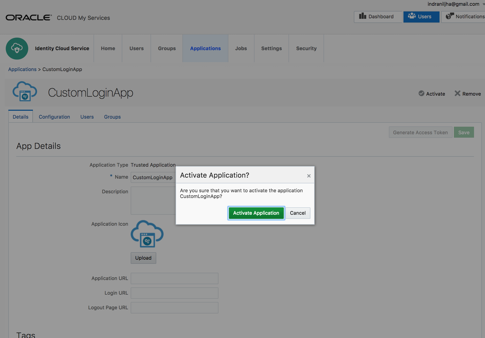

# Enhanced Login Experience

Oracle Identity Cloud Service (**IDCS**) supports customized login experience by hosting a login application and redirecting IDCS to the new application.
 

## Demo Objective

Configure IDCS to leverage a custom login page hosted externally.

## Persona

Administrators, End-Users

## Demo Logistics

* Ensure that the host on which the external application will run has JDK 1.7+ installed, and `java` executable is present on the **PATH**

* Tomcat server for hosting. Download [here](resources/tomcat.zip) or use your own server.

* Sample custom login application built using JSP and Servlets. Download [here](resources/myapp.war)

## Create IDCS App 
`(Persona: Administrators)`

Custom login application needs to be able to securely call IDCS API's in the background. To allow this, a server app needs to be created in IDCS.

* Go to IDCS Admin console -> **Applications** tab

* Click on **Add button** and select **Trusted Application**


* Provide a name for the app **CustomLoginApp** and click on **Next**


* Select the radio button **Configure this application as a client now**

* Enter values for the following attributes and click on **Next**

```
Allowed Grant Types: Check "on" "Client Credentials" and "Resource Owner"
Allow non-HTTPS URLs: Check "on"
Redirect URL: http://demo.oracledemo.com:9095/myapp/atreturn/
Grant the client access to Identity Cloud Service Admin APIs: Check "on"
Select the Admin API "Signin"
```


* Click on **Next**. 


* click on **Finish**


* Note the **Client ID** and **Client Secret**. Close the popup.


* **Activate** the app.




## Deploy Custom Login Application
`(Persona: Administrators)`

This section is specific to the sample app provided here. Steps will vary based on the design and technology used to build the app. The provided sample is built using JSP/servlet and will be deployed on a Tomcat server.

* Download `tomcat.zip` and unzip on the host the application will be running on. 

```
ijhost:CustomLoginDemo indraniljha$ ls
tomcat.zip

ijhost:CustomLoginDemo indraniljha$ unzip tomcat.zip
```


* Go to the `webapps` sub-directory under the explored tomcat directory `tomcat`.

```
ijhost:CustomLoginDemo indraniljha$ cd tomcat/webapps/
```

* Copy downloaded sample application `myapp.war` under the `webapps` directory

```
ijhost:webapps indraniljha$  cp ~/Downloads/myapp.war .
```

* Go to the directory `tomcat/bin` and run `startup.sh` or `startup.bat` depending on your host OS.

```
ijhost:webapps indraniljha$  cd ../bin
ijhost:bin indraniljha$ ./startup.sh 
```


* Gather the IP address of the host running tomcat. Update your local system (from where you will launch the browser) with the hostname `demo.oracledemo.com` and corresponding IP address. 

```
In Linux/Mac:
Edit /etc/hosts file with the entry ->
<IP_ADDRESS_OF_TOMCAT_HOST>	demo.oracledemo.com

ijhost:bin indraniljha$ cat /etc/hosts
##
# Host Database
##
127.0.0.1	localhost demo.oracledemo.com
```

<blockquote>
	In case you are running tomcat in your local host, map demo.oracledemo.com against 127.0.0.1 in the host file
</blockquote>

* Verify that the tomcat default page shows up when the following URL is accessed - [http://demo.oracledemo.com:9095](http://demo.oracledemo.com:9095)


## Configure Custom Login Application
`(Persona: Administrators)`

This section is also specific to the sample app provided here. Steps will vary based on the design of the app. The provided sample persists the IDCS configuration information using the following steps

* Store the **Client ID** and **Client Secret** for the sample app's sso service calls.
	*	Access the URL [http://demo.oracledemo.com:9095/myapp/addcreds/IDCS-TENANT-NAME>](http://demo.oracledemo.com:9095/myapp/addcreds/IDCS-TENANT-NAME) from your browser
	<blockquote>
		Replace IDCS-TENANT-NAME with your IDCS tenant name
	</blockquote>
	
	* Provide the **Client ID** and **Client Secret** of the IDCS app **CustomLoginApp** and submit


* Store the **Client ID** and **Client Secret** for the sample app's to access to the the IDCS app.
	*	Access the URL [http://demo.oracledemo.com:9095/myapp/appconfig/IDCS-TENANT-NAME](http://demo.oracledemo.com:9095/myapp/appconfig/IDCS-TENANT-NAME) from your browser
	<blockquote>
		Replace IDCS-TENANT-NAME with your IDCS tenant name
	</blockquote>

	* Provide the **Client ID** and **Client Secret** of the IDCS app **CustomLoginApp** and submit


## Configure IDCS 
`(Persona: Administrators)`

Follow the simple steps below to configure IDCs to leverage the custom login page.

* Go to IDCS Admin console -> **Settings** tab -> **Session Settings** from the left sidebar menu

* Change the value of **Login URL** to 
[http://demo.oracledemo.com:9095/myapp/signin/IDCS-TENANT-NAME]([http://demo.oracledemo.com:9095/myapp/signin/IDCS-TENANT-NAME)

<blockquote>
		Replace IDCS-TENANT-NAME with your IDCS tenant name
</blockquote>

* Activate **Allow Cross-Origin Resource Sharing (CORS)**

* For **Allowed CORS Domain Names** enter the value **oracledemo.com**


* **Save** the new settings.


## Verify Custom Login 
`(Persona: End-Users)`

* From you browser run [http://demo.oracledemo.com:9095/myapp/setdomain?domainName=IDCS-TENANT-NAME&host=.identity.oraclecloud.com](http://demo.oracledemo.com:9095/myapp/setdomain?domainName=IDCS-TENANT-NAME&host=.identity.oraclecloud.com)

<blockquote>
		Replace IDCS-TENANT-NAME with your IDCS tenant name
</blockquote>


#### Note:
*The way this sample application has been designed, the domain information has session-persistence and will be lost following tomcat server shutdown. For predictable result, run the previous step every time before testing.*
</blockquote>

* Go to IDCS User Console. Verify that the Custom Login page shows up instead of the default login page.


* Provide IDCS user credentials for **dcrane** and click on **SignIn** button.


* If there is an 2-factor authentication challenge, provide response to the challenge.


* Verify that **dcrane** is successfully logged in.


* Logout of IDCS. Verify that the logout ends up redirecting to the custom login page


