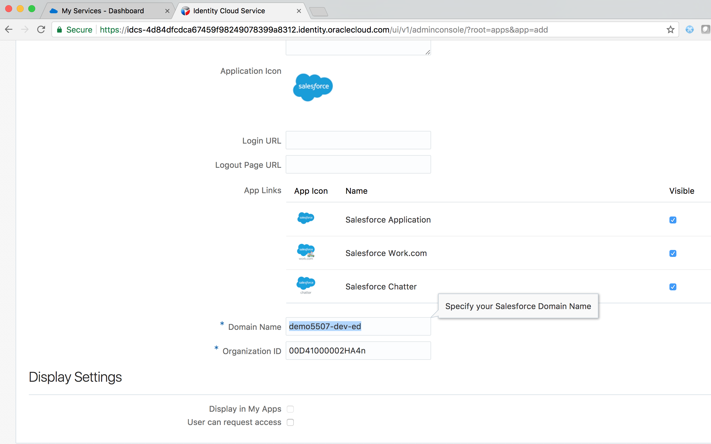
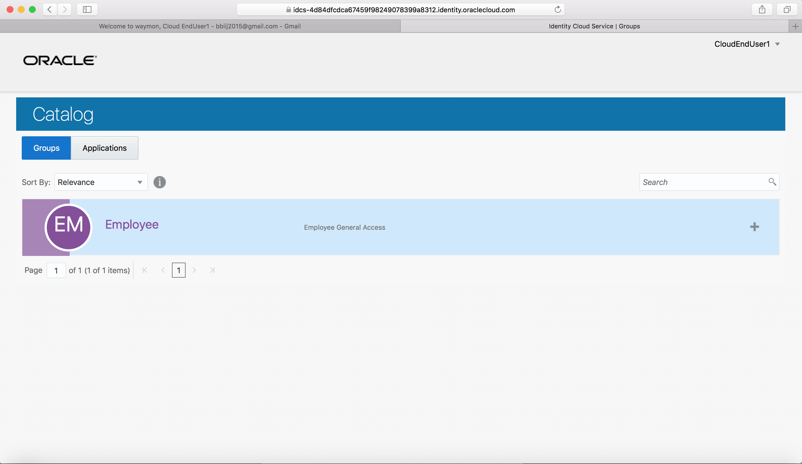
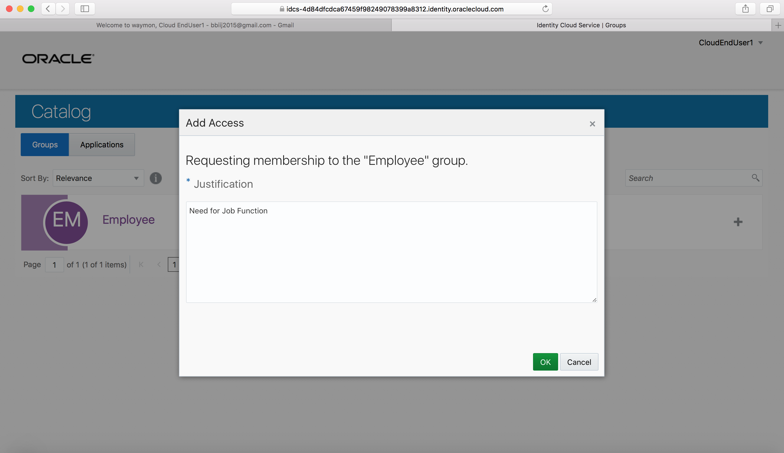
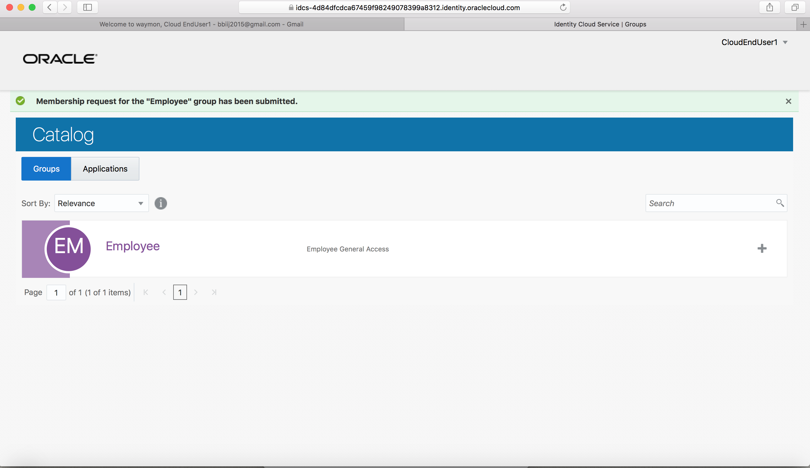
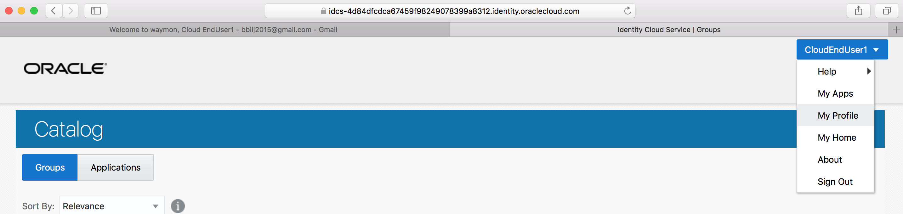
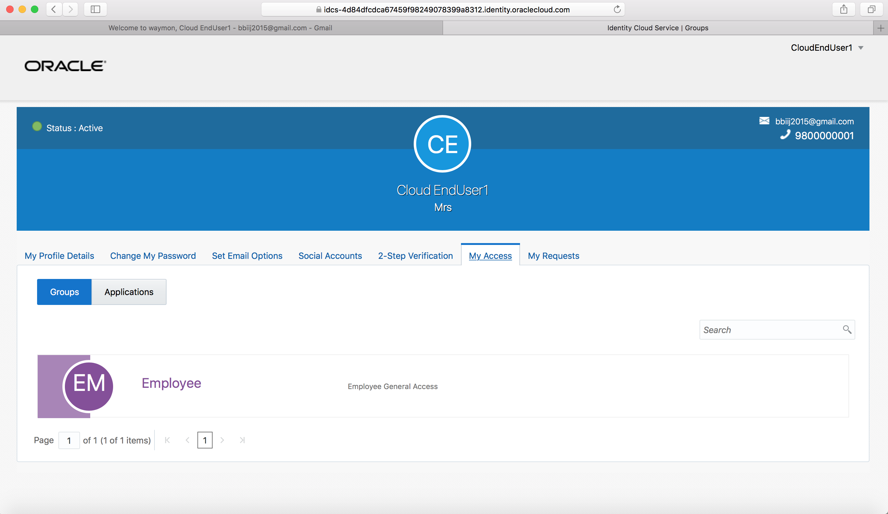
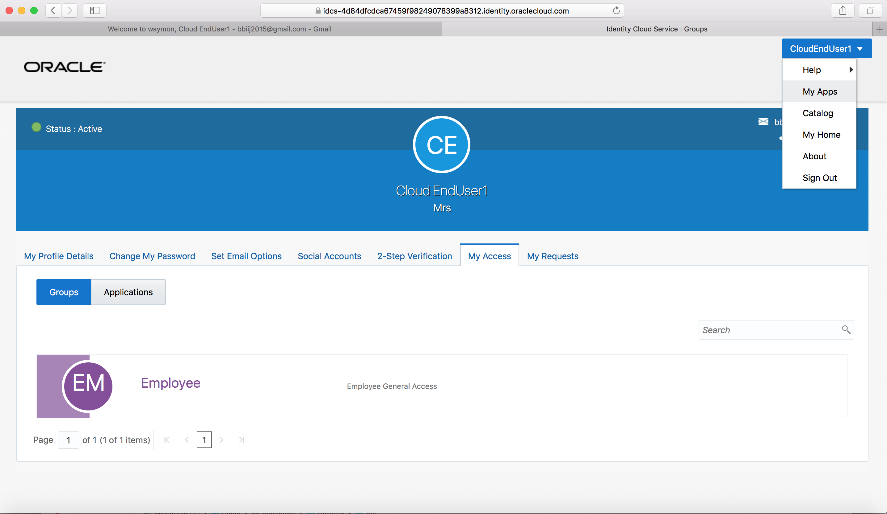
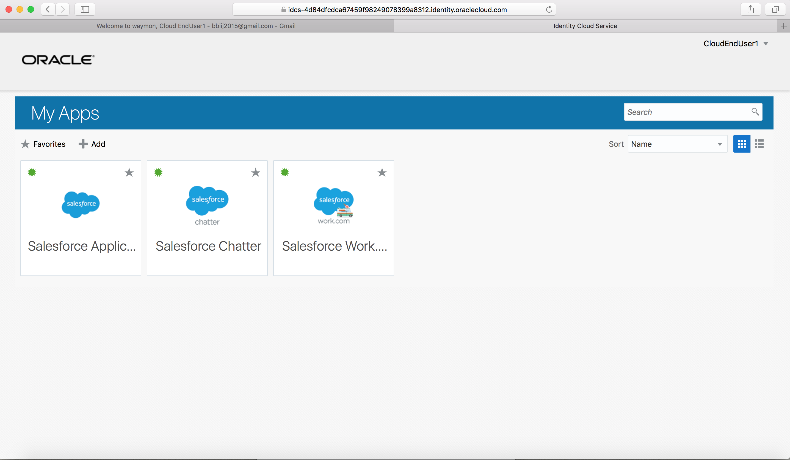
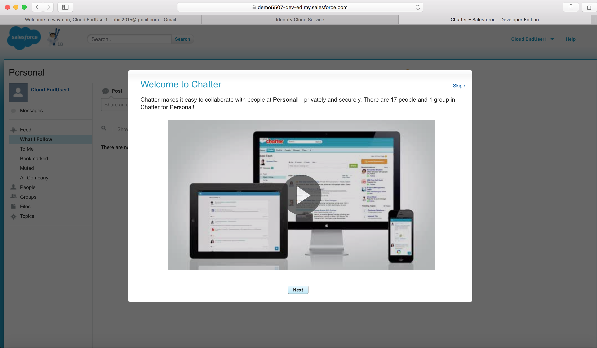

# Integrate Apps - SAML

- Download IDCS Metadata to a local XML file 

	

- Login to salesforce.com tenant with Administrator credentials

- Go to Single Sign-On settings under  Security Controls menu

- Enable Federated Single Sign-On 

	

- Import IDCS Metadata - Use New from Metadata File option
 
- Save the configuration 

	

    

    

    

     Change

     Change

- Note the Organization ID value 

	  Change

- Note the Tenant Domain Name value 

	 Change

- Go to IDCS Admin console -> Applications tab

- Click on Add button and select App Catalog 

	

- Search for Salesforce App and Add 

	
	
	

- On the first page of Configuration screen provide the previously noted Organization ID and Domain Name values

- Click on Next 

	

- Click on Finish button  

	

- Activate the application 

	

## Assign Apps to Group - (Persona: Administrator)

- Go to IDCS Admin Console -> Groups tab 

	

- Add group `Employee`. Check the box `User can request access`. 

	

- Click on `Finish` 

	

- Go to the `Access` tab. Click on `Assign`. 

- Select `Salesforce` and confirm 

	
	
	
	
	
## Request Group - (Persona: End-User)

- From MyApps page click on `Add` access request button.

	

- From the **Groups** tab, select `Employee` group

	
	
- Click on `+` sign to request access to the group. Provide justification on the resulting popup page. Click on `OK`

	
	
	
	
- Go to `My Profile` section from menu located top-right

	
	
- Ensure that `Employee` group is visible under **My Access** sub-tab
	
	
	
- Go to `My Apps` section from menu located top-right

	
	
- Ensure that Salesforce applications are visible now on the **MyApps** page
	
	

## Verify Apps SSO - (Persona: End-User)

- Click on the `Salesforce Chatter` app. 
- Ensure that user is automatically logged-in to Salesforce Chatter (**SSO**)

	