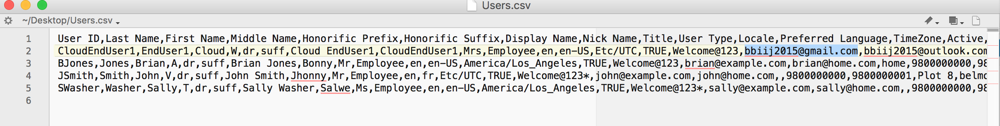
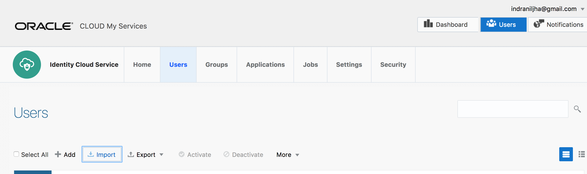
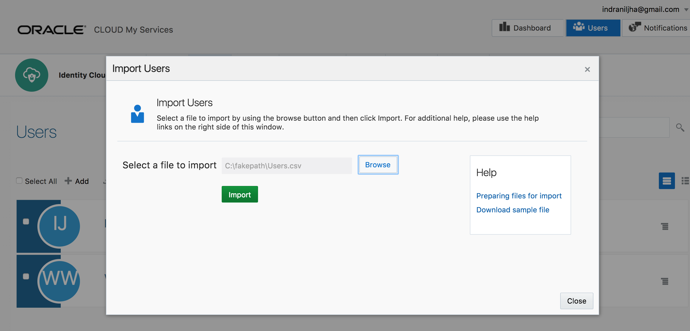
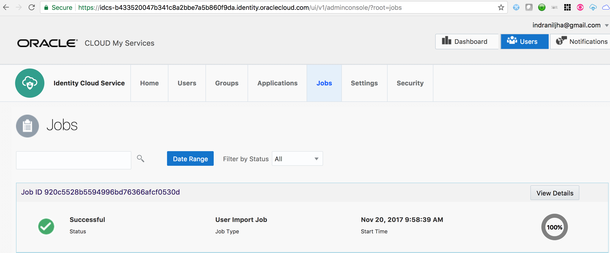
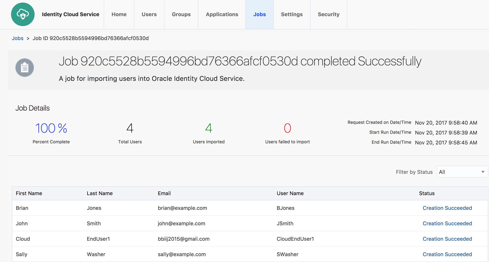
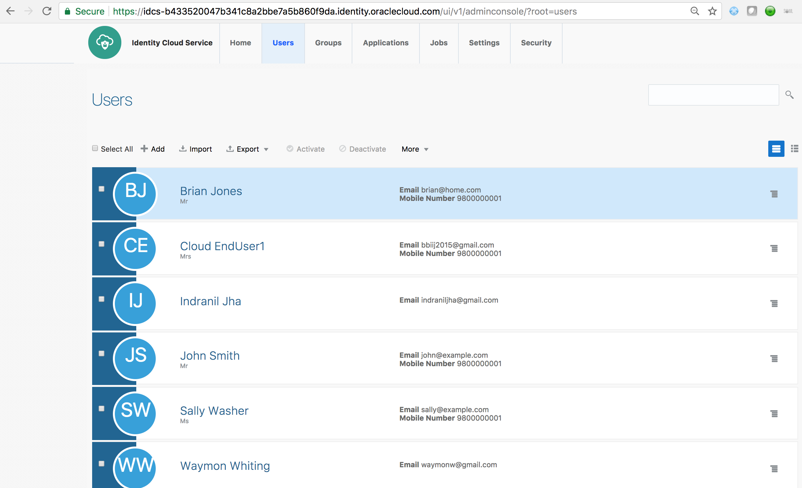
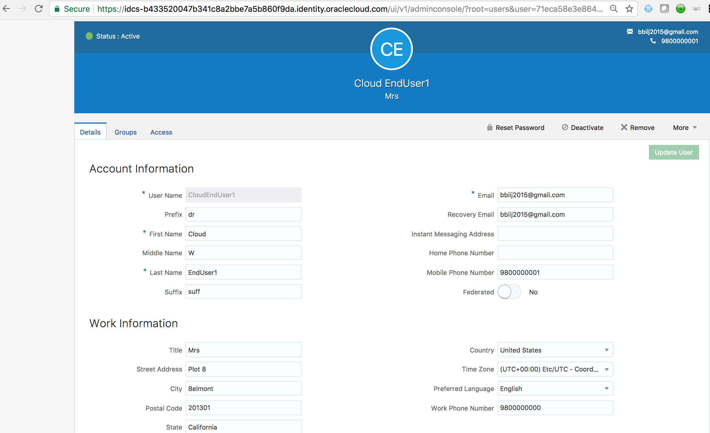

# User On-boarding - Delimited File

### **STEP 1**: Obtain Upload CSV file

- Obtain the CSV file **Users.csv** provided here. Inspect the content of the file opening it in your favorite editor.
	
	
	
- Make sure that your target End User with proper ***Email Address*** is present on the file. If not there, make necessary changes.

### **STEP 2**: Import File in IDCS

- Go to IDCS Admin console using your Administrator Account credentials as described [here](#adminconsole). Ensure that you are on the **Users** tab

- Click on the **Import** button. 

	
	
- Select the **CSV** file. Click on **Import**

    

- Go to the **Jobs** tab in Admin Console. Verify that the Import Job finished successfully. Click on **View

    
    
- Click on **View Details** button. This will show the detailed information on the ***Import** job. Inspect the details.

     

### **STEP 3**: Verify User Creation

- Go to the **Users** tab in Admin Console. Verify that the new users are visible on the console.

    

- Click on your target End-User and verify User's detailed attribute information

    