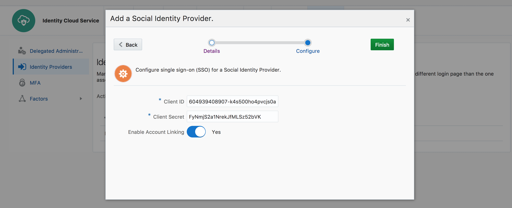
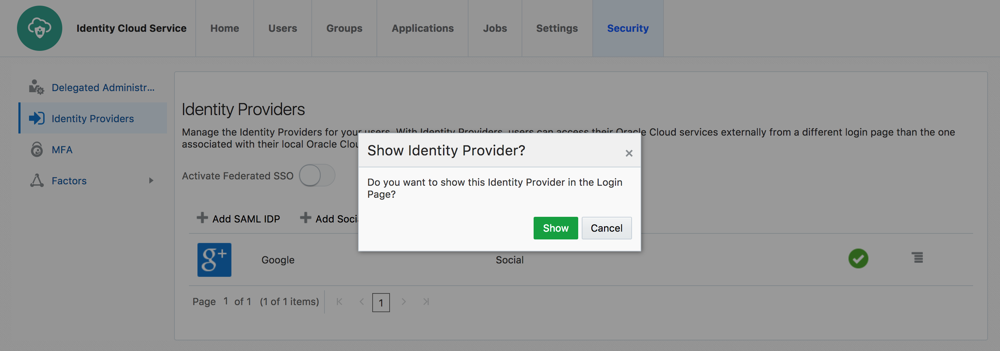

# Social Identity Provider

Oracle Identity Cloud Service(IDCS) supports social identity providers so that users can log in to IDCS with their social credentials. Social login feature allows users to self-register in IDCS if they do not already have an account.

Following Social providers comes out-of-the-box with IDCS -

* Facebook
* Google
* LinkedIn
* Microsoft
* Twitter

IDCS also supports any generic social identity provider that is **OpenID Connect** compliant.

## Demo Objective

1. Configure IDCS to leverage **Google** as the social identity provider. 
2. (Optional) Establish **Auth0** as the social provider leveraging **Generic OpenID Connect** provider support.

## Persona

Administrators, End-Users

## Demo Logistics

G-suite account for **Google** authentication provider configuration. For this demonstration, we will be using necessary parameters from a pre-existing account.

## Configure IDCS to use Google Provider
`(Persona: Administrators)`

* Go to IDCS Admin console -> **Security** tab -> **Identity Providers** from the left sidebar menu


* Click on **Add Social IDP**

* Select the type as **Google**. Provide a name of the provider. We will use an intuitive one - **Google**


* Provide the provider parameter values -

```
Client ID - 291328507778-r3h3k909dg7ponsf6mpal6vlc8vlu29p.apps.googleusercontent.com
Client Secret - URCTp86DdeQ8N2ojgl9Jpjnd
```


* Click on **Finish**


* **Activate** the provider


* Enable the option **Show on Login Page**





* Finally enable the option **Activate Federated SSO**


## Verify Social Login
`(Persona: End-Users)`

* Go to IDCS user console. Verify that IDCS login page shows the option **Sign in with Google**


* Click on **Google**

* From the popup sign-in page for google, login with [demoidcs@gmail.com]()


* Verify that, the flow comes back to IDCS login screen with a message **You don't have an account....[Click here to register]()**. Click on the link


* On the registration page notice that the first name and last name have been populated automatically. IDCS gets this information from the social provider. 


* Click on **Register**. This will create the user in IDCS and link with the social identity.

* **Skip** if there is any prompt for 2-factor authentication enrollment.


* Verify that user can see an empty **MyApps** page


* Logout of IDCS and Google

* Login again in IDCS using **Google** provider as [demoidcs@gmail.com]()

* Verify that after successful google authentication, user is logged in to IDCS MyApps console without any additional prompt.

## End-to-end Configuration

For configuring social authentication with Google, an OAuth client need to be setup in [Google Developer Console](https://console.developers.google.com). In the demo, existing OAuth client details (**Client ID** and **Client Secret**) have been used. 

The end-to-end integration starting from setup in [Google Developer Console](https://console.developers.google.com), has been captured in this *less than 7 minutes* video -

<iframe width="560" height="315" src="https://www.youtube.com/embed/JU8ArDvzWq0" frameborder="0" allow="autoplay; encrypted-media" allowfullscreen></iframe>


## (Optional) Auth0 Integration

This optional video demonstrates using and setting up **Auth0** as the social provider. It leverages generic **OpenID Connect** provider of IDCS.

<iframe width="560" height="315" src="https://www.youtube.com/embed/kgik7VDdn-k" frameborder="0" allow="autoplay; encrypted-media" allowfullscreen></iframe>