# Multi Factor Authentication

When a user signs in to an application, they are prompted for their user name and password, which is the first factor – something that they know. With **Multi Factor Authentication (MFA)** enabled in Oracle Identity Cloud Service, the user is then required to provide a second type of verification. This is called **2-Step Verification**.

The two factors work together to add an additional layer of security by using either additional information or a second device to verify the user’s identity and complete the login process.

## Persona

Administrators, End-Users

## Configure MFA
`(Persona: Administrators)`

* Go to IDCS Admin Console -> **Security** tab. Select **MFA** from the Sidebar to the left.

* Select `All Users` for the label **Select the users that you want to enable MFA for:**

* Select all the options for **Select the factors that you want to enable:**

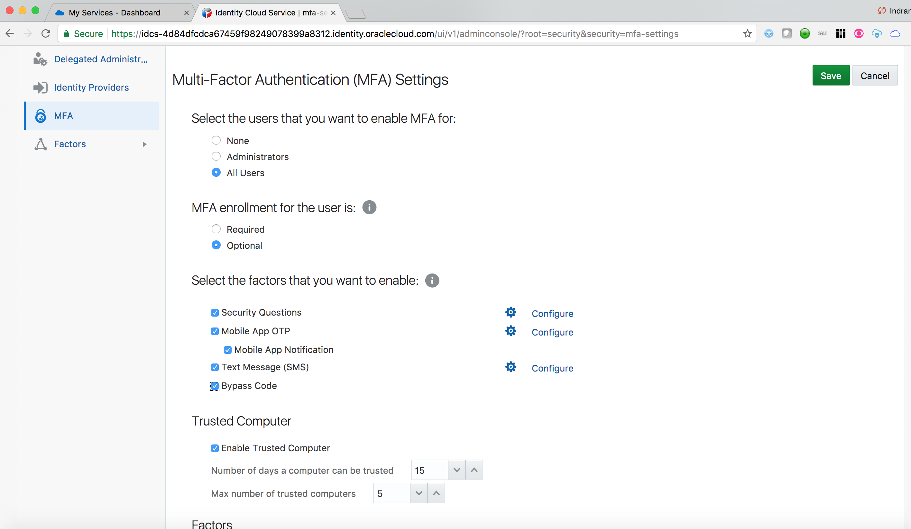

* Keep all other parameters to their Default values. Click on **Save**

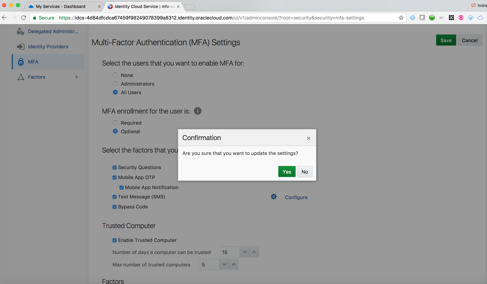
	
	
## Enroll in MFA - Text Message (SMS)
`(Persona: End-Users)`

After MFA is enabled, when an end-user logs in to IDCS, she is provided with MFA enrollment option. 

Since the default settings has enrollment as  **Optional**, user can **Skip** the enrollment. In that case, she will not be prompted for enrollment next time she logs in IDCS. However, she can do so from the **My Profile** page after login.

* Login to IDCS as **dcrane**

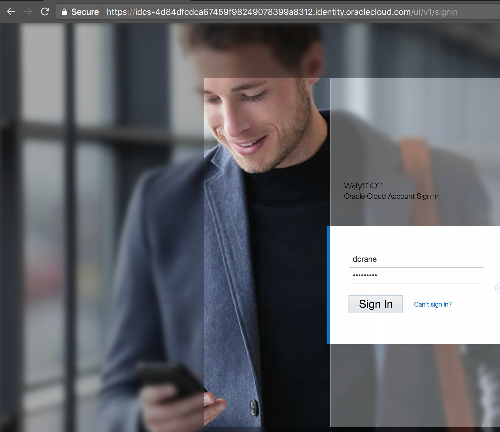

* On the **Enable 2-Step Verification** page after login to IDCS, click on **Enable**

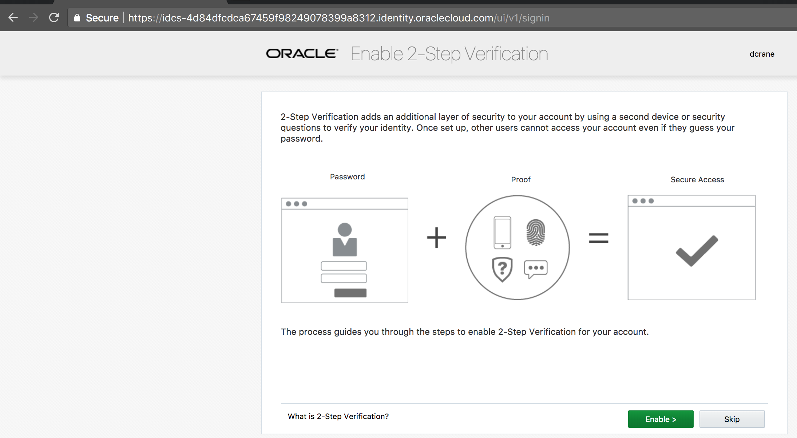

* Select the method **Mobile Number**

* Provide your mobile number and click on **Send**

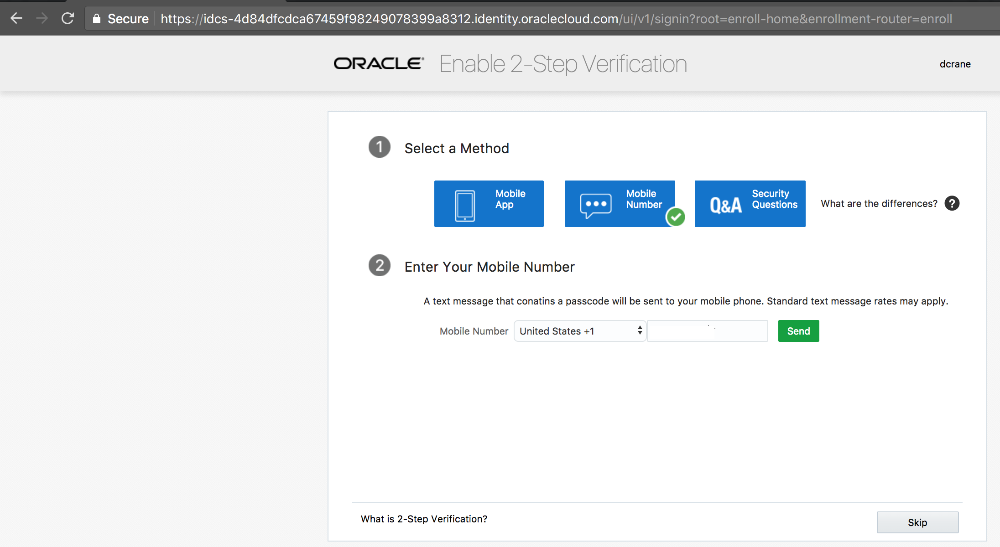
	
* Access the text message on your mobile and note the 6-digit One-time code on the message.
	
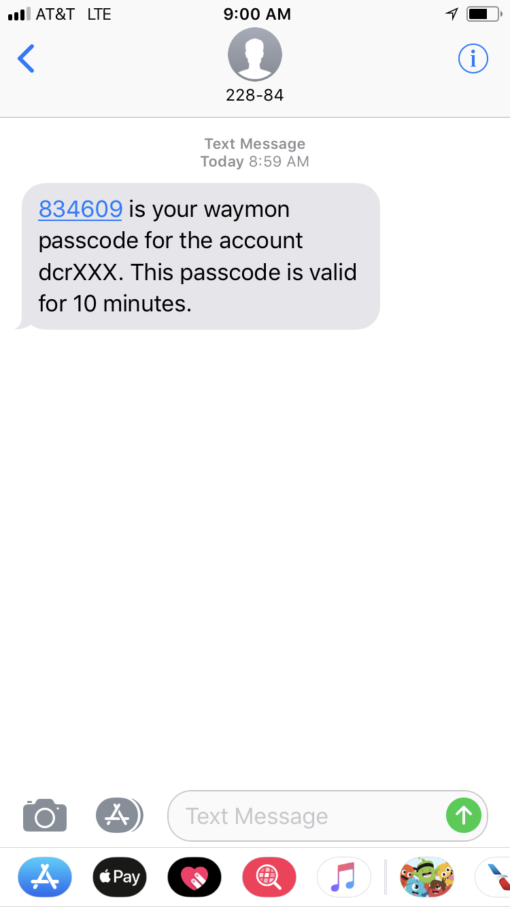

* Provide the 6-git code on the enrollment page and click on **Verify**

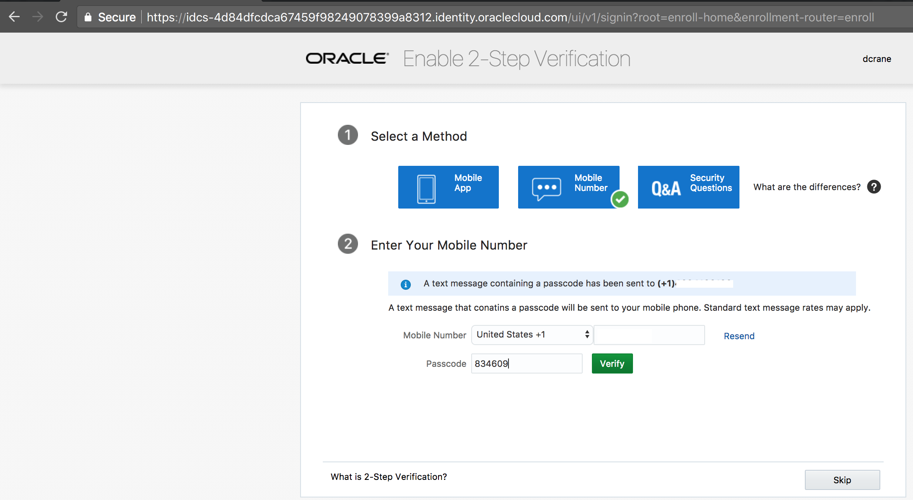
	
* Verify that the success enrollment message is displayed. Click on **Done**
	
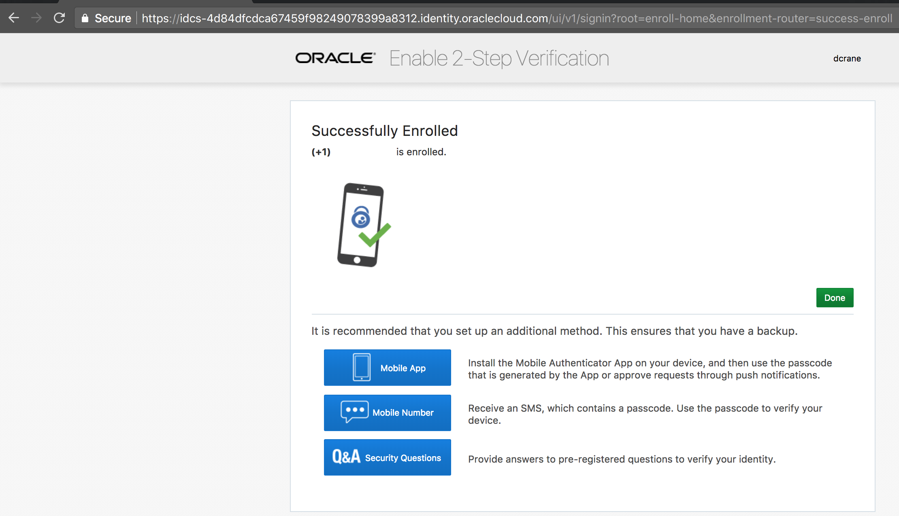
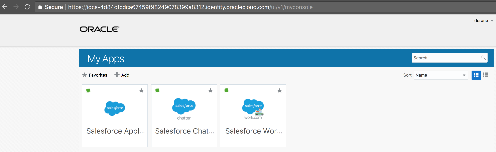

* Logout from IDCS

## Verify MFA
`(Persona: End-Users)`

* Login to IDCS as **dcrane**

* Verify that IDCS prompts for **2-Step Verification** challenge

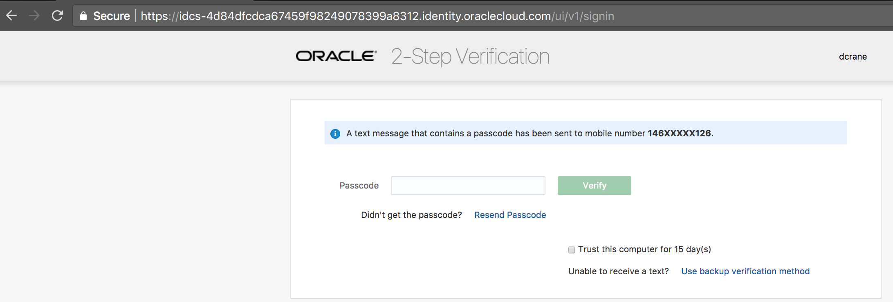

* Access the text message on your mobile and note the 6-digit One-time code on the message.

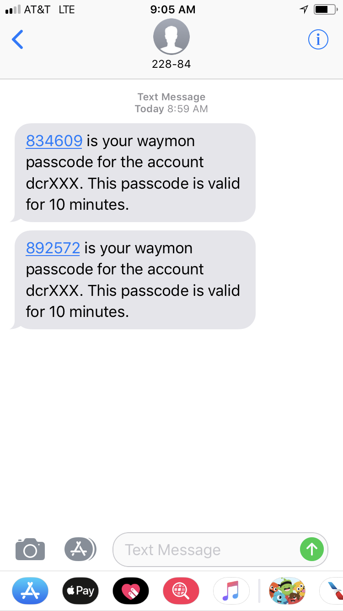

* Provide the 6-git code on the challenge page and click on **Verify**

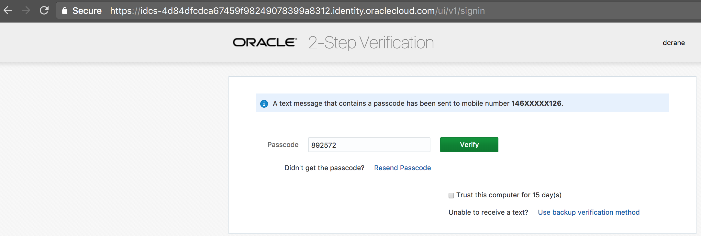

* Verify that **dcrane** successfully logs in 

