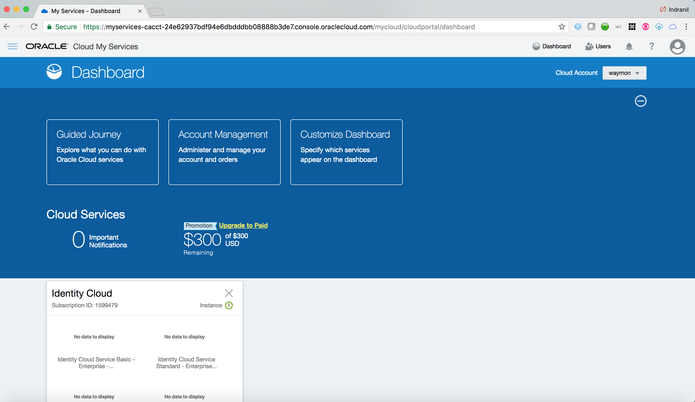
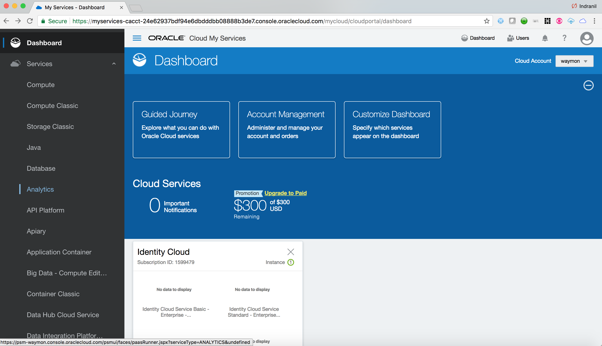
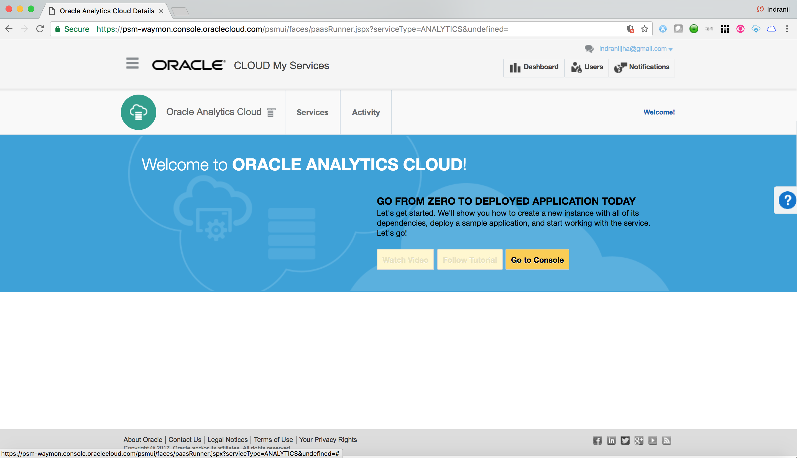

# Oracle Public Cloud One-Stop Access

### IDCS is baked into Oracle Public Cloud

### Accessing Oracle Cloud Services

- Click on **Dashboard** to come back to My Services page again. Display the sidebar by clicking on the bar in the upper left hand corner. then click on **Services** to display available Oracle Cloud Services.

	
	
	
	
- Click on the Service **Analytics**. Observe that the logged in user has successfully single signed-on to the Analytics service console

	