# B2C: Self-Registration


## Create External Group

- Go to IDCS Admin Console -> Groups tab 

- Add group `OurPartner`

	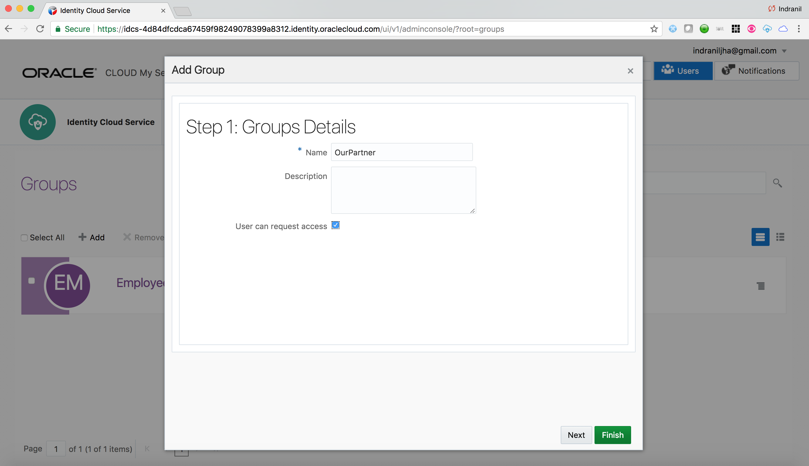

- Click on `Finish`

	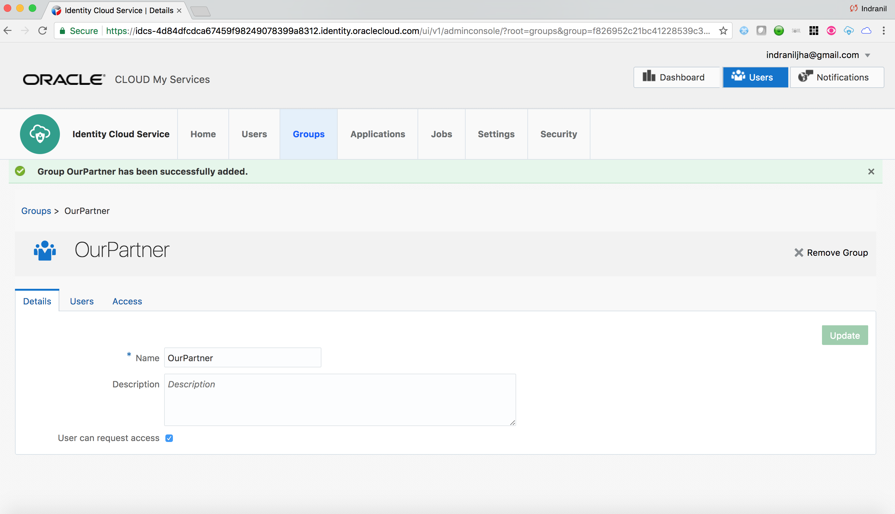 


## Create Registration profile  - (Persona: Administrator)

- Login to IDCS Admin Console as an Administrator. Go to the **Settings** tab and click on the **Self Registration** menu from the sidebar.

	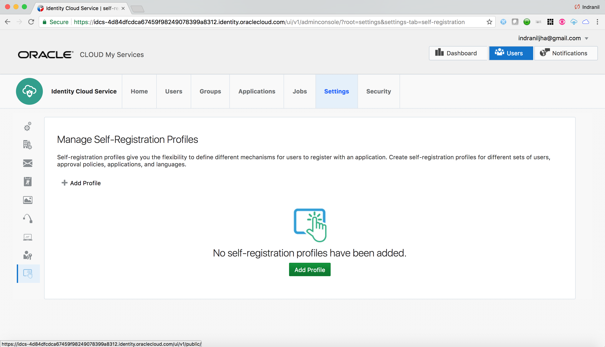

- Click on **Add Profile**

- On the Profile creation page, enter `Profile Name -` **`OurPartner`**. 

	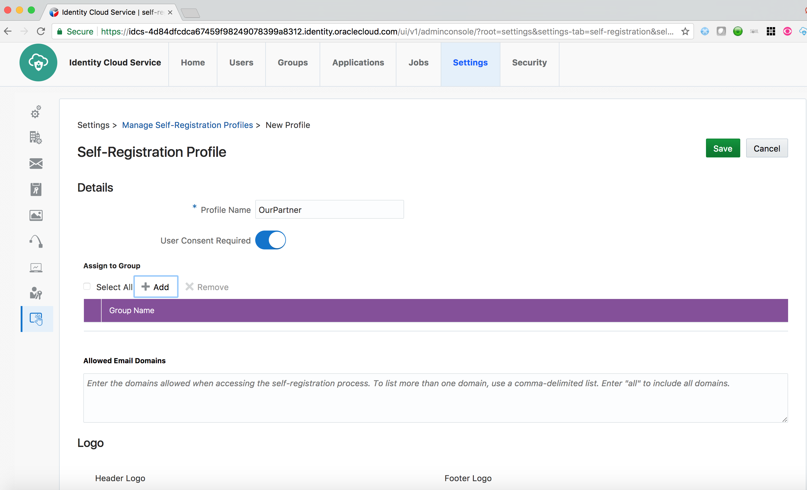

- Click on **Add** under `Assign to Group` section. Select the external group **`OurPartner`** and click on **OK**

	

- Under `Self-Registration Content` section, enter `Registration Page Name -` **`OurPartner`**.

	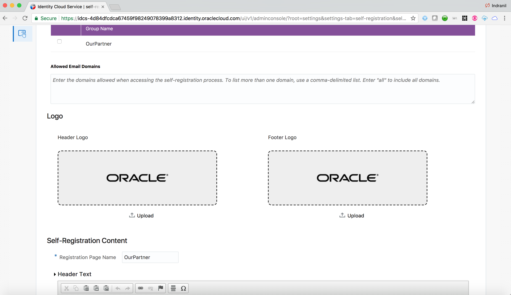

- Review the remaining sections. Keep the default values.

	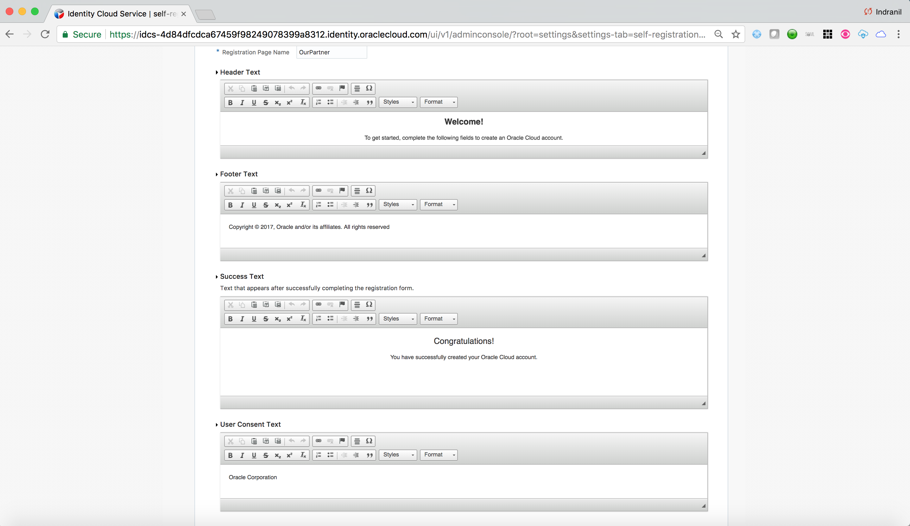

- Click on **Save** and then click **Yes** on the **Confirmation**.

	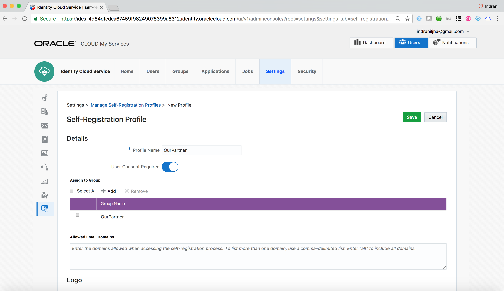
	
	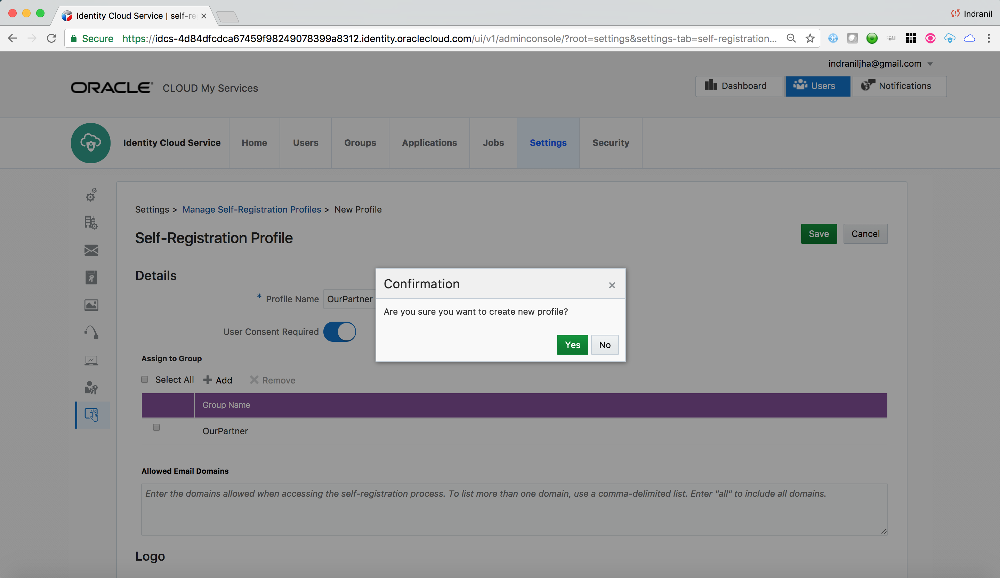

- Click on **Activate** and then **Activate Profile**

	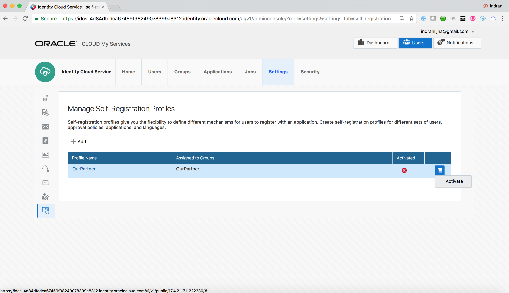
	
	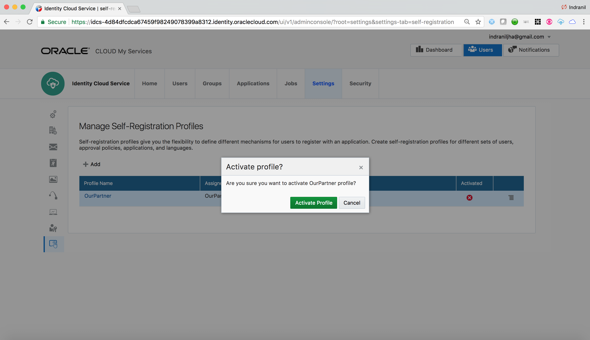

- Note the **`Profile ID`** and create the self-registration link in the following format :

	```js
	https://<tenant>.identity.oraclecloud.com/ui/v1/signup?profileid=<Noted Profile ID>
	```
	<blockquote>
	This link can be forwarded in the registration invitation email or other channel to the external users.
	</blockquote>
	
	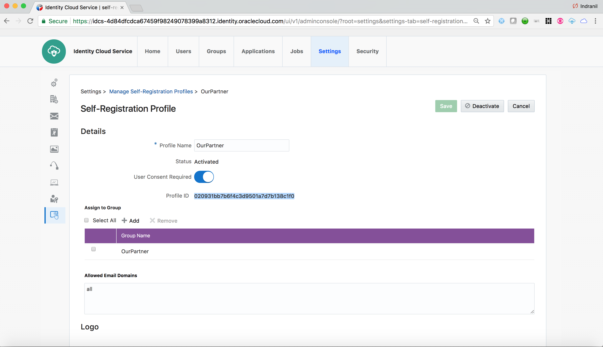

## Self Registration - (Persona: End-User)

- Click on the Registration link supplied.

	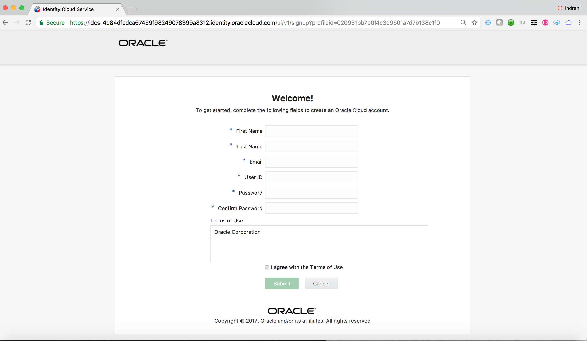

- Enter required profile information and **submit**

	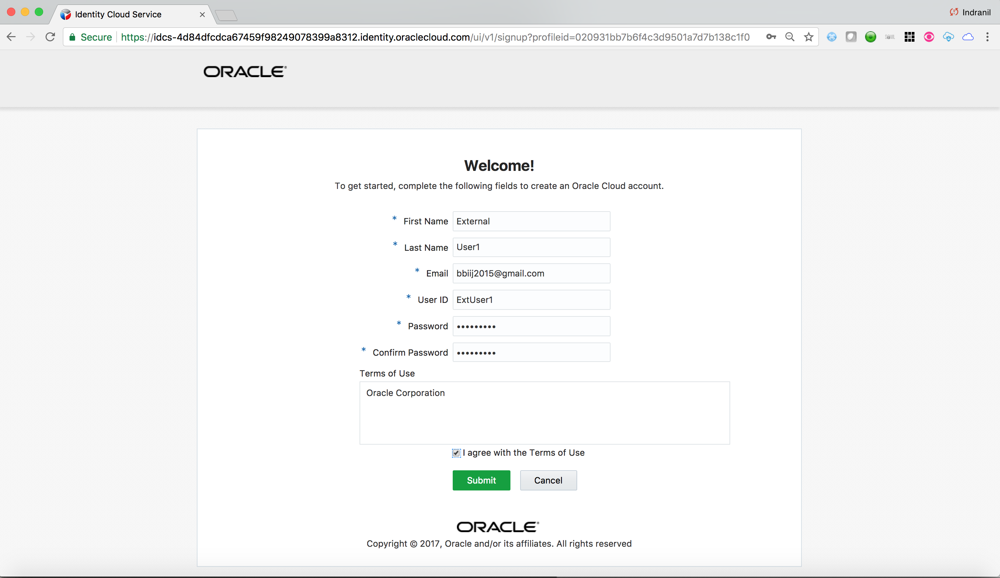

- On the Success message page, click on **continue**. **Skip** the 2-step verification.

	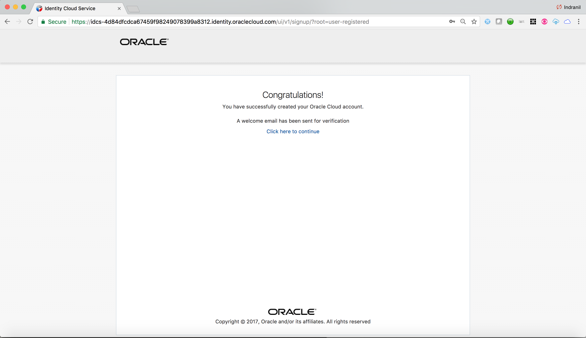
	
	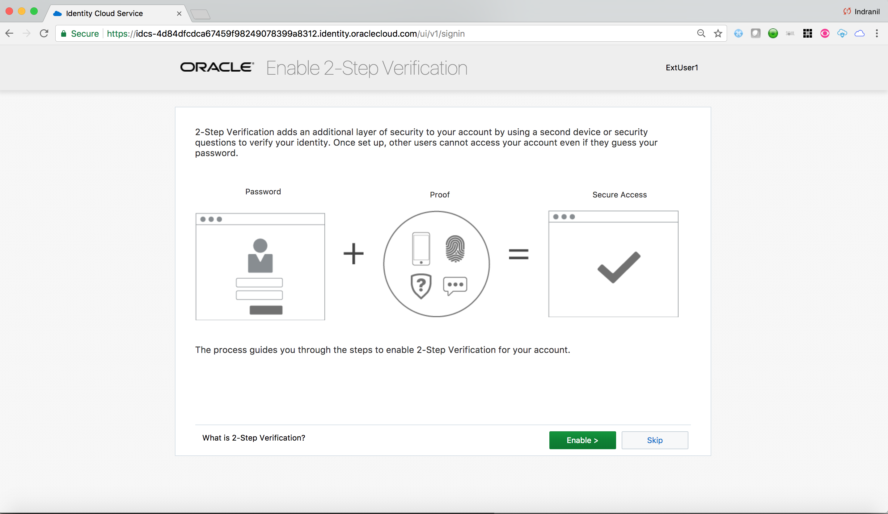

- From the `My Apps` page access the `My Profile` menu. 

	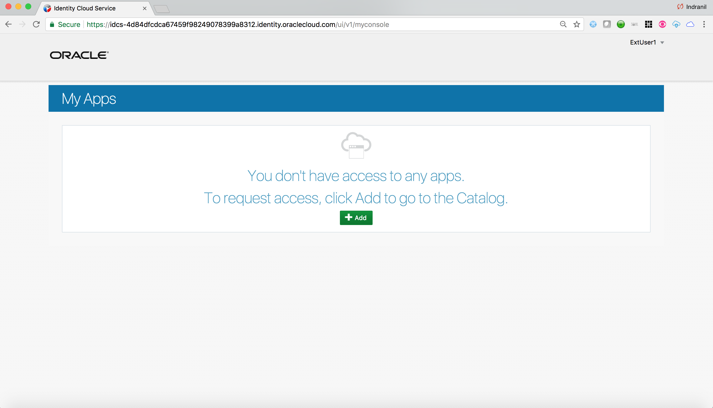
	
	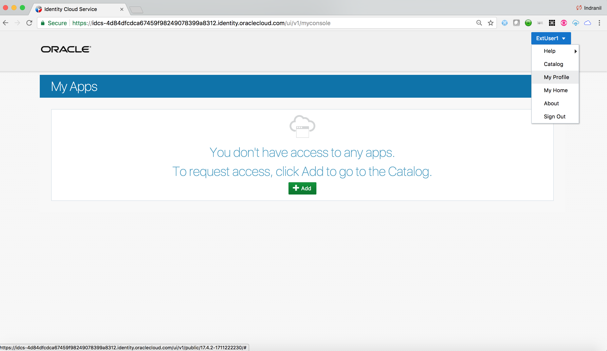

- Go to the `My Access` tab. Ensure that user is part of the group configured in the registration profile. 

	<blockquote>
	If the group is assigned to one or more apps in IDCS, the new user will automatically gain access to those apps, and the apps will be visible on the My Apps page.
	</blockquote>
	
	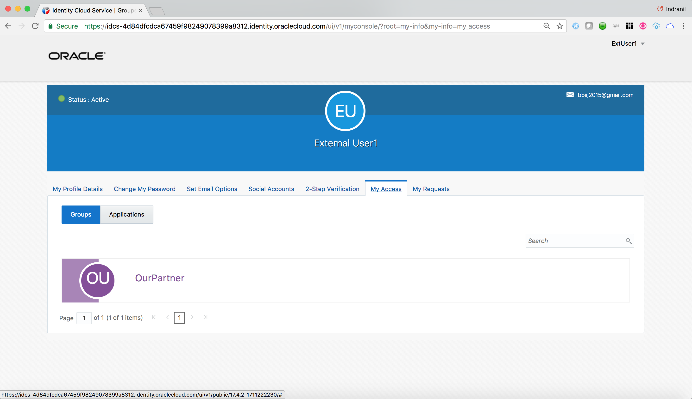