# User On-boarding - Enterprise Directory Synchronization

Active Directory's Users and Groups can be synchronized to IDCS using the **Microsoft Active Directory Bridge**.

You can select which AD containers of Users and Groups will be synchronized.
A User's password is **NOT** synchronized. So users will need to either -

* "Activate" (have email sent to them with link) which will let them set a password, or 
* Federate into IDCS - using your companies' SAML Identity Provider (IDP) - for example - **Active Directory Federation Service (ADFS)**

## Persona

Administrators

## Demo Logistics

Windows Server 2012 equipped with .NET framework 4.6+. The script has been tested with Windows 2012 64-bit Server.

## Active Directory Setup

#### Installing Active Directory
* Log into Active Directory Machine as Administrator

* Copy install script file [createDomain.ps1](resources/createDomain.ps1) onto your Active Directory machine.
	[populateAD.ps1 ](resources/populateAD.ps1) 
	
* Right click on **createDomain.ps1** and choose run with PowerShell.

	
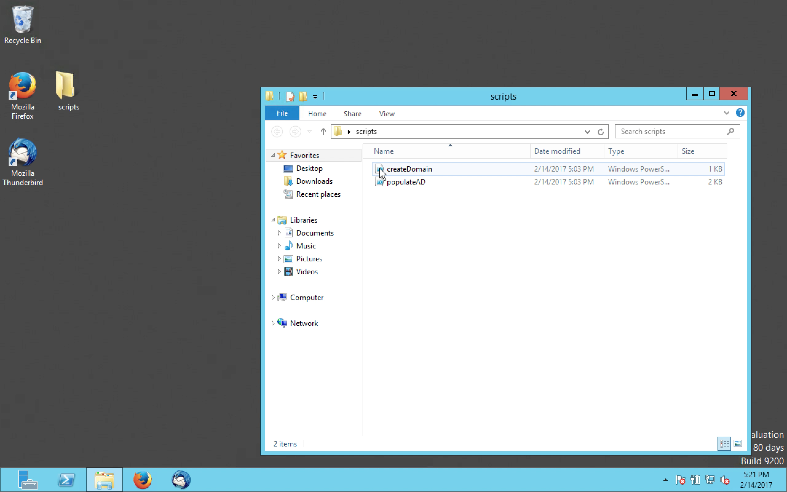
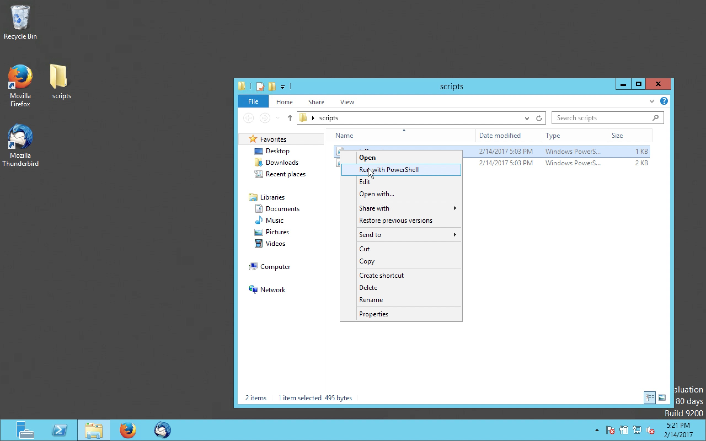

* This will run a script and then reboot. It will show a list of errors which can be disregarded. The process should take between 5-10 minutes.

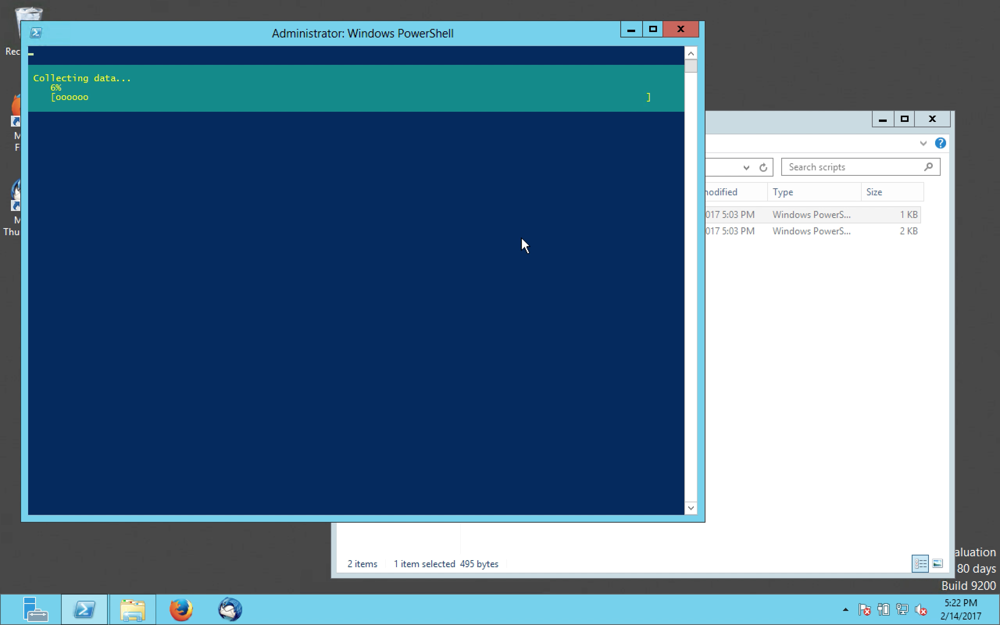
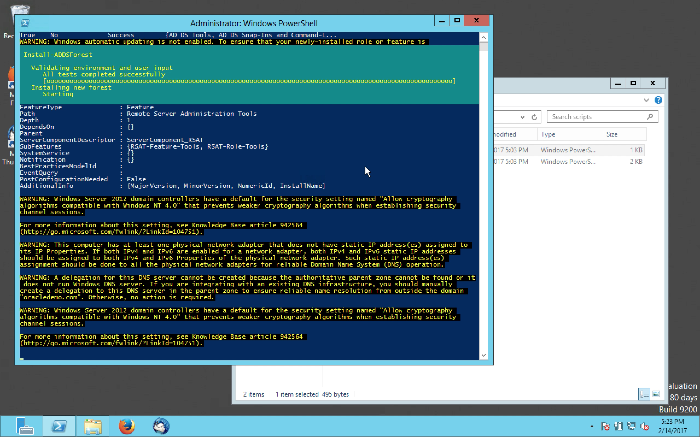
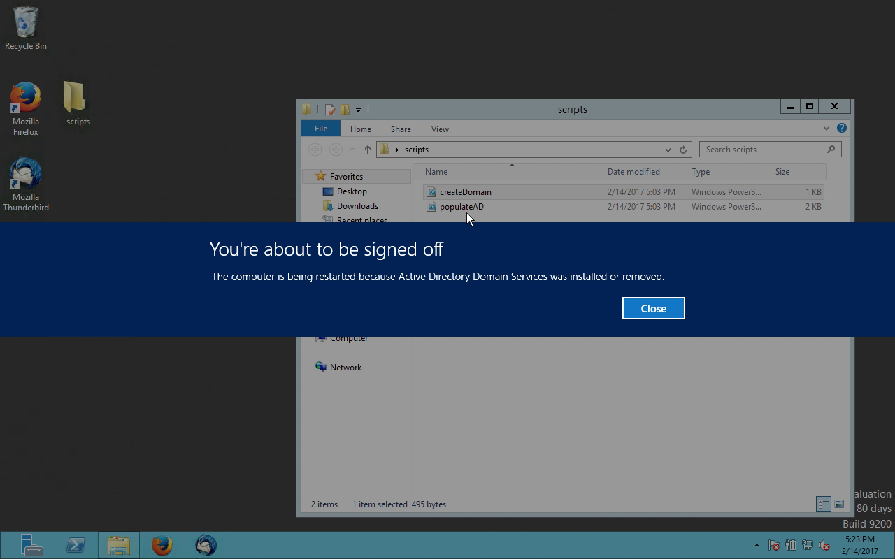

#### Populating Active Directory with required users and Orgs

* Log into Active Directory Machine as `administrator@oracledemo.com`. 

* Download and copy [populateAD.ps1 ](resources/populateAD.ps1) to this machine if you have not done so already.

* Right click on **populateAD.ps1** and choose run with PowerShell.

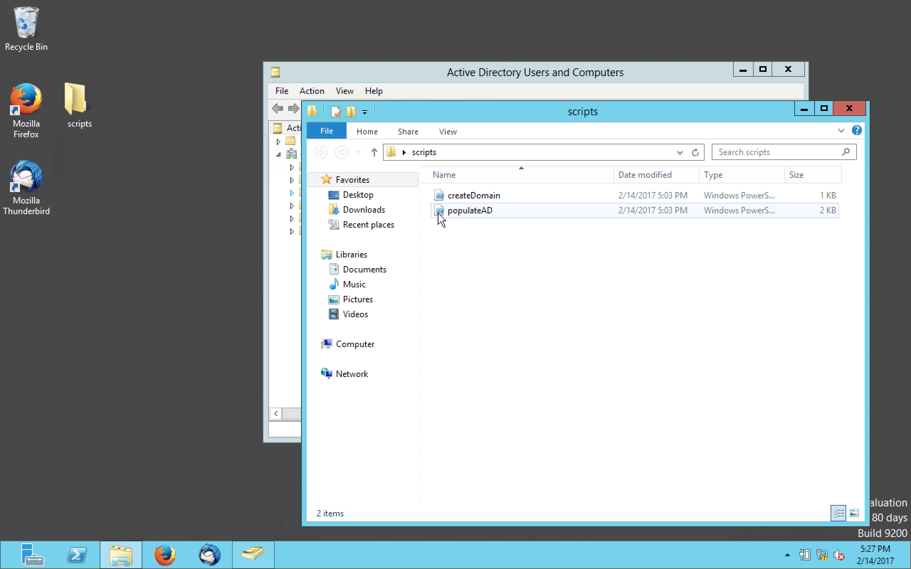
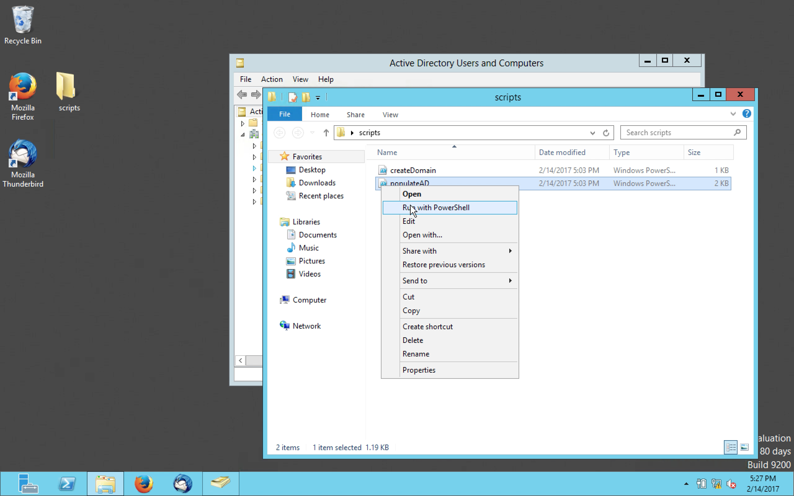

* The powershell script will say *complete* when completed. You can then close the powershell window. 

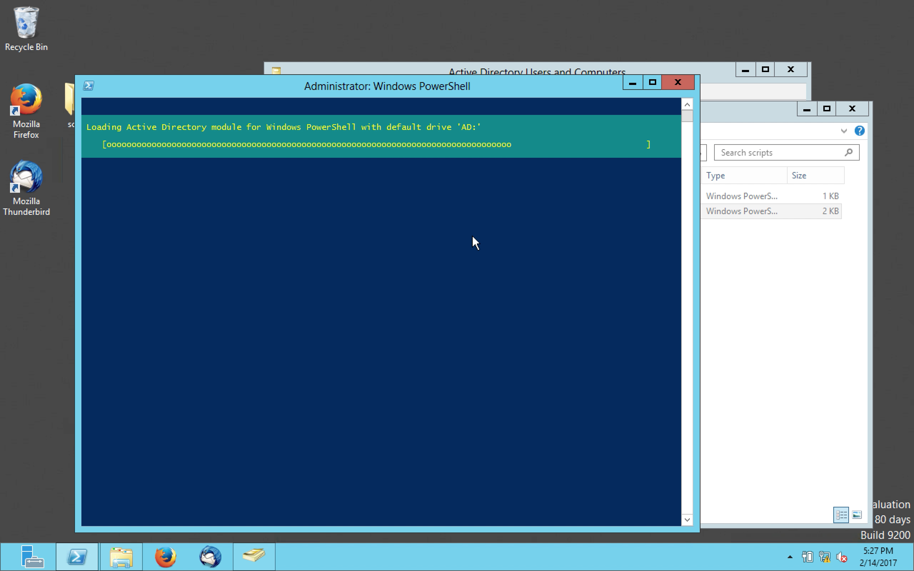
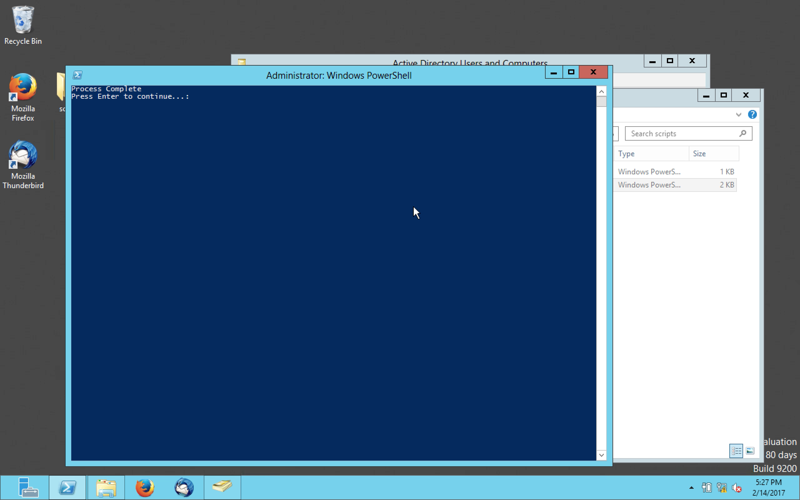

* The Users, OUs and groups should now exist.

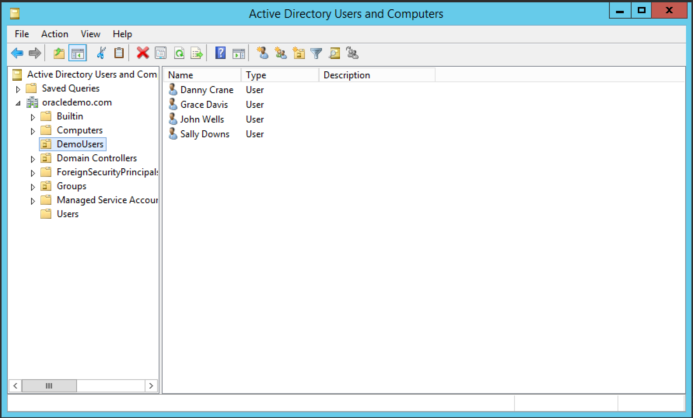
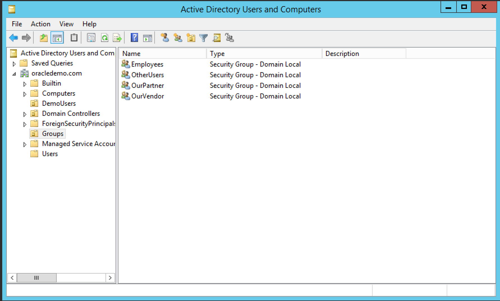

#### Adding the IDCS certificate to local certificate store
1. Open Internet Explorer
2. Go to: `https://mydemotenant1.idcs.internal.oracle.com:8943`. This will first show a security alert. Click OK

3. Click continue to site 

4. Click on the security report in URL bar 
5. Click view Certificate 
6. Click Certification Path  and then make sure to highlight IDCS Development Root CA.  Then Click View Certificate. 
7. Click Install Certificate 
8. Xelect Local Machine Store Location, then Next 
9. Select Place all certificates in the following store, then click Browse. 
10. Slect Trusted Root Certification Authority, then click OK. 
11. Click Next to install the certificate. 
12. Click Finish to install cert.
12. Click OK when cert is installed. 

####Firefox Certificate Validation
1. open firefox and navigate to `https://mydemotenant1.idcs.internal.oracle.com:8943/ui/v1/adminconsole`. This will genrate a Security Error 
2. Click Advanced 
3. Click Add Exception. 
4. Click Confirm Security Exception  

## Configure Identity Bridge

* Log into IDCS Admin Console 

* Click Download and Config ID Bridge from bottom of screen.

 

* Enter your AD Domain name in the Domain Name box `oracledemo.com` 

* Click Download. This will download the IDBridge installer to your local machine. 

 

* Close this dialog box by clicking OK 

* Copy the ClientID and Shared secret information

* Create a text file to save this information for later use. 

* Paste information from clipboard into text file 

* Back in the IDCS Admin Console click configure button in the ID Bridge configuration screen. 

7. Change the syncronization time to something shorter than 1 Hour. (1-5 minutes are good options) 
8. Uncheck the "Users can login to cloud applications using AD password". Uncheckig this setting will ensure the generated password is sent to the user. In not, IDCS will assume that the users are federated.  
9. Open the IDBridge MSI installer that was downloaded earlier.  
10. Click next, then choose an install directory. The default is fine.   
11. Click Install and then Finish. This will then open the Config UI 
12. Enter the Cloud Service URL in the appropriate box.  `https://mydemotenant1.idcs.internal.oracle.com:8943` 
13. Enter the Client ID and Shared Secret from the text file and click next. (you can click test if you would like to test connection to IDCS)      

14. Enter The connection information for the agent to connect to Active Directory. This includes:
	* Domain Name - The domain name of your Active Directory 
		 `oracledemo.com`
	* Host - Host of the Active Dirctory 
		  `localhost`
	* SSL Enabled - Connect to AD with SSL 
		 `un-checked`
	* Port - Active Directory Port 
	`389`
	* Bind User - User used to connect to Active Directory
	`administrator@oracledemo.com`
	* Bind Password - Password associated with above user 
	`Oracle123` 
15. click next (you can click test if you would like to test connection to Active Directory)  
16. Choose OU's that will be synced (`Select All`)   
17. Choose Groups that will be synced (`Select All`)  
18. Click Finish. This will save all settings and kick off an initial sync   
 
#### UC1.1.2 Activate and verify new user via UI
1. Open Thunderbird and check for new mail.
2. Click on existing email 
3. Click on activate account 
4. Enter a new password and click confirm   
#### UC1.1.3 User modification and sync
1. Log into IDCS Admin Console and show DCRANE user     
2. Open Active Directory Users and Administrators   
3. Make change to Danny Crane. You can remove him from Employees group and change his first name.       
3. Wait 2 minutes for Sync process to run. Once completed, show changes in IDCS.    
#### UC1.1.4 User revoke/de-provisioning
1. Open Active Directory Users and Administrators 
2. Delete DCRANE user.   
3. Wait for sync . ( you can show information on sync process at this point)       
4. Show in IDCS DCRANE no longer exists.   

## Addtional Resources

* [Understanding the Bridge](https://docs.oracle.com/en/cloud/paas/identity-cloud/uaids/understanding-bridge.html)

* Tutorial: [Oracle By Example (OBE): Oracle Identity Cloud Service: Integrating with Microsoft Active Directory Using Directory Integrations](http://www.oracle.com/webfolder/technetwork/tutorials/obe/cloud/idcs/idcs_idbridge_obe/idbridge.html) 

* An Approach to AD Bridge HA using Docker and Windows Containers - [OTN Link](http://www.oracle.com/technetwork/articles/idm/gutierrez-idcs-idbridge-3960710.html)

